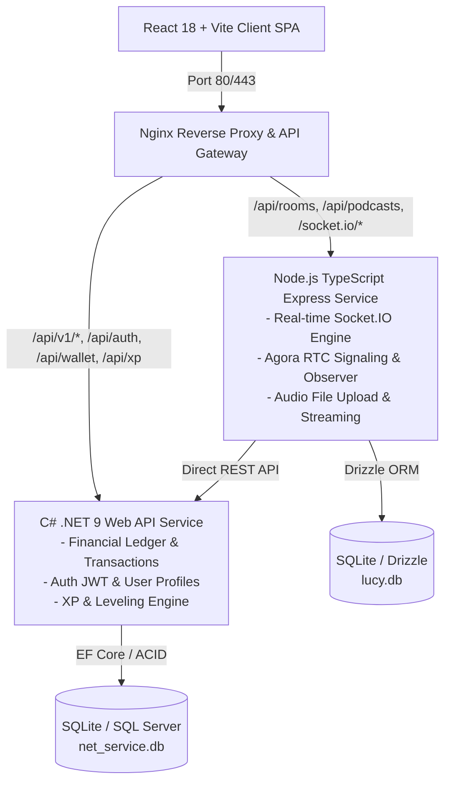

# BÁO CÁO PHÂN TÍCH VÀ THIẾT KẾ KIẾN TRÚC PHẦN MỀM (SOFTWARE ARCHITECTURE & DESIGN REPORT)
## Dự án: LUCY — Gamified Social Audio & Language Learning Platform
**Môn học**: SWD392 - Software Architecture and Design

---

## 1. TỔNG QUAN HỆ THỐNG VÀ ĐỊNH HƯỚNG KIẾN TRÚC (HIGH-LEVEL ARCHITECTURE)

Hệ thống **LUCY** được thiết kế dựa trên mô hình **Polyglot Microservices với Reverse Proxy API Gateway**. Thay vì sử dụng một Monolith duy nhất, hệ thống chia nhỏ thành các phân hệ độc lập dựa trên đặc tính kỹ thuật phù hợp nhất với từng công nghệ:

---

## 2. PHÂN TÍCH CHI TIẾT THEO TÍNH NĂNG & MẪU KIẾN TRÚC (ARCHITECTURAL PATTERNS BY FEATURE)

### 2.1. Phân hệ Giao dịch Tài chính & Ví tiền (Wallet, Gift & Monetization)

- **Kiến trúc được chọn**: **Double-Entry Ledger Pattern (Nhật ký sổ kép) + Layered Architecture (N-Tier Architecture trong .NET 9)**.
- **Cách hoạt động**:
  - Tách biệt rõ ràng 3 lớp: `Controllers` $\rightarrow$ `Application Services (IGiftService, IXpService)` $\rightarrow$ `Data Access (EF Core / AppDbContext)`.
  - Mọi thao tác nạp tiền, gửi quà (Gift), donate creator không bao giờ cộng/trừ trực tiếp số dư đơn thuần mà bắt buộc tạo bản ghi kép trong `WalletLedger` (Ghi nợ `Sender` - Ghi có `Recipient`) và `GiftTransaction`.
- **So sánh với Kiến trúc tương tự (Alternative Architecture)**:
  - *Phương án thay thế (Direct Balance Mutation)*: Chỉ dùng hàm `UPDATE Users SET Balance = Balance - X WHERE Id = 1`.
  - *Lý do không chọn*: Dễ gây xung đột ghi nhận (Race Condition) khi 2 request gửi đồng thời, không có dấu vết đối soát (Audit Trail), khi xảy ra sự cố không thể khôi phục lại lịch sử tài khoản.
- **Ưu điểm vượt trội của kiến trúc đã chọn**:
  - **Tính toàn vẹn tài chính (ACID Compliance)**: Đảm bảo giao dịch thực hiện trọn vẹn trong một Transaction.
  - **Khả năng kiểm toán (Auditability)**: Nhật ký sổ kép cho phép kiểm toán 100% dòng tiền ra/vào hệ thống.
  - **An toàn cho Creator**: Hỗ trợ donate cho cả Creator nội bộ lẫn Host bên ngoài/hệ thống mà không vi phạm ràng buộc khóa ngoại (Foreign Key Integrity).

---

### 2.2. Phân hệ Phòng Học Nói Trực Tiếp (Real-Time Speaking Room & Audio Stream)

- **Kiến trúc được chọn**: **Event-Driven Architecture (EDA) + Peer-to-Peer Audio Signaling (Agora WebRTC + Socket.IO)**.
- **Cách hoạt động**:
  - Các hành vi trong phòng (giơ tay `hand-raise`, duyệt nói `grant-speak`, ghi âm `start-recording`, cập nhật sóng nhạc) hoạt động theo cơ chế **Publish/Subscribe**.
  - Server duy trì một trạng thái bộ nhớ đệm (In-Memory Room Registry) để phản hồi ngay lập tức cho hàng trăm socket mà không cần truy vấn database liên tục.
- **So sánh với Kiến trúc tương tự (Alternative Architecture)**:
  - *Phương án thay thế (RESTful HTTP Polling / Long Polling)*: Client gửi request HTTP định kỳ mỗi 1 giây để hỏi "Có ai giơ tay không?".
  - *Lý do không chọn*: Gây lãng phí tài nguyên CPU, băng thông mạng khủng khấp (x hàng nghìn request vô ích/giây) và độ trễ cao (>1000ms), không đáp ứng được tính tương tác trực tiếp của phòng nói audio.
- **Ưu điểm vượt trội của kiến trúc đã chọn**:
  - **Độ trễ cực thấp (Ultra-Low Latency < 50ms)**: Sự kiện đẩy ngay tức thì đến đúng danh sách Client trong phòng via Socket.IO Room Channels.
  - **Khả năng mở rộng (Scalability)**: Tách biệt luồng Audio chính (truyền qua mạng Agora RTC SFU) và luồng điều khiển Trạng thái (Signal Socket.IO Node.js).

---

### 2.3. Phân hệ Podcast & Lưu trữ Bài Giảng (Audio Media Pipeline & Streaming)

- **Kiến trúc được chọn**: **Asynchronous Buffer Pipeline + Static Streaming Proxy (Nginx Static Proxy & HTTP Range Request)**.
- **Cách hoạt động**:
  - Khi phòng dừng ghi âm (`stop-recording`), các khối dữ liệu âm thanh (`audio/webm`) được gom tại Client và đẩy lên Node.js qua luồng Multipart Form Stream.
  - File âm thanh được lưu trữ trực tiếp trên tập tin ổ đĩa (File System `/uploads/podcasts/`), còn Database SQLite chỉ lưu đường dẫn URI meta data. Nginx đảm nhận phân phối file tĩnh.
- **So sánh với Kiến trúc tương tự (Alternative Architecture)**:
  - *Phương án thay thế (Database BLOB Storage)*: Lưu trực tiếp dữ liệu binary của file âm thanh MP3/WebM vào cột `BLOB` trong Database SQL.
  - *Lý do không chọn*: Làm phình đại dữ liệu Database cực nhanh, nghẽn RAM khi đọc file lớn, không hỗ trợ tính năng nghe tua (Seeking) mượt mà.
- **Ưu điểm vượt trội của kiến trúc đã chọn**:
  - **Hỗ trợ HTTP Range Requests (Partial Content 206)**: Người nghe có thể nhấp tua đến bất kỳ giây nào trong Podcast mà không cần tải lại toàn bộ file.
  - **Giải phóng RAM Server**: Nginx xử lý đọc và gửi dữ liệu tĩnh trực tiếp từ ổ đĩa kernel (sendfile), không tốn bộ nhớ Node.js process.

---

### 2.4. Phân hệ Quản lý Vòng đời Phòng Học (Room State Lifecycle)

- **Kiến trúc được chọn**: **Finite State Machine Pattern (Máy trạng thái hữu hạn - FSM)**.
- **Cách hoạt động**:
  - Mỗi phòng học chỉ được phép tồn tại ở một trong các trạng thái nghiêm ngặt: `Lobby` $\rightarrow$ `Topic` $\rightarrow$ `Transition` $\rightarrow$ `Closed`.
  - Các thao tác như chuyển Sub-Level, ghi âm Podcast, cấp quyền nói chỉ hợp lệ khi phòng đang ở đúng trạng thái cho phép.
- **So sánh với Kiến trúc tương tự (Alternative Architecture)**:
  - *Phương án thay thế (Ad-hoc Boolean Flags)*: Dùng hàng loạt cờ `isLive=true`, `isTransitioning=false`, `isClosed=false` rải rác.
  - *Lý do không chọn*: Rất dễ dẫn đến trạng thái không hợp lệ (Invalid State Trap), ví dụ phòng vừa đóng nhưng vẫn ghi âm hoặc nhảy sub-level.
- **Ưu điểm vượt trội của kiến trúc đã chọn**:
  - Code minh bạch, dễ bảo trì, ngăn ngừa triệt để các lỗi xung đột trạng thái phòng học.

---

### 2.5. Phân hệ Kiểm soát Cấp độ & Giới hạn Phòng (Level Requirement Guard)

- **Kiến trúc được chọn**: **Policy-Based Authorization Guard & Adaptive Gamification Formula**.
- **Cách hoạt động**:
  - Cấp độ người dùng được tính toán động dựa trên tổng số điểm XP tích lũy:
    $$\text{UserLevel} = \min\left(100, \left\lfloor\frac{\text{XP}}{50}\right\rfloor + 1 + \text{RoleBonus}\right)$$
  - Phân quyền vào phòng áp dụng quy tắc thử thách mở rộng: Người dùng chỉ được vào các phòng có `LevelId <= UserLevel + 3`.
- **Ưu điểm**:
  - Bảo vệ trải nghiệm người dùng: Tránh việc học viên mới (Beginner Level 1) vào nhầm các phòng thảo luận chuyên sâu (Level 50+), gây áp lực và làm giảm chất lượng phòng học.
  - Đồng thời cho phép Super Host/Giảng viên mở khóa toàn bộ 100 level để thực hiện nhiệm vụ giảng dạy.

---

## 3. BẢNG TỔNG HỢP SO SÁNH CÁC LỰA CHỌN KIẾN TRÚC (DECISION MATRIX)

| Tiêu chí | Kiến trúc Monolith Thuần túy | Microservices Thuần túy (Docker/Kubernetes) | **Mô hình Hybrid của LUCY (Lựa chọn)** |
| :--- | :--- | :--- | :--- |
| **Độ phức tạp hạ tầng** | Rất thấp | Rất cao (Cần DevOps, Service Mesh) | **Vừa phải** (Tận dụng Nginx Proxy) |
| **Tốc độ xử lý Real-time** | Trung bình | Tốt (nhưng dính đỗ trễ inter-service) | **Cực cao** (Node.js xử lý Socket/WebRTC trực tiếp) |
| **Tính an toàn tài chính** | Khá | Cần Distributed Transactions (Saga) | **Tối ưu** (.NET 9 đảm nhận ACID Ledger độc lập) |
| **Khả năng bảo trì (Maintainability)**| Giảm dần theo thời gian | Cao | **Rất cao** (Tách biệt ngôn ngữ phù hợp thế mạnh) |

---

## 4. KẾT LUẬN

Việc lựa chọn kiến trúc **Hybrid Polyglot Microservices (Node.js + .NET 9 + React 18)** trong dự án **LUCY** không phải là sự ngẫu nhiên mà là kết quả của việc phân tích cẩn trọng các yêu cầu phi chức năng (Non-Functional Requirements):
1. **Node.js** giải quyết bài toán xử lý I/O phi đồng bộ thời gian thực cho Audio & Socket.
2. **.NET 9** giải quyết bài toán tính toán tài chính, điểm thưởng XP an toàn, chính xác và hiệu năng cao.
3. **Double-Entry Ledger & FSM Pattern** bảo đảm tính toàn vẹn dữ liệu hệ thống.

Sự kết hợp này mang lại cho dự án một hệ thống vừa có tốc độ phản hồi cực nhanh (<50ms), vừa có độ tin cậy chuẩn tài chính ngân hàng, dễ dàng mở rộng và nâng cấp trong tương lai.
