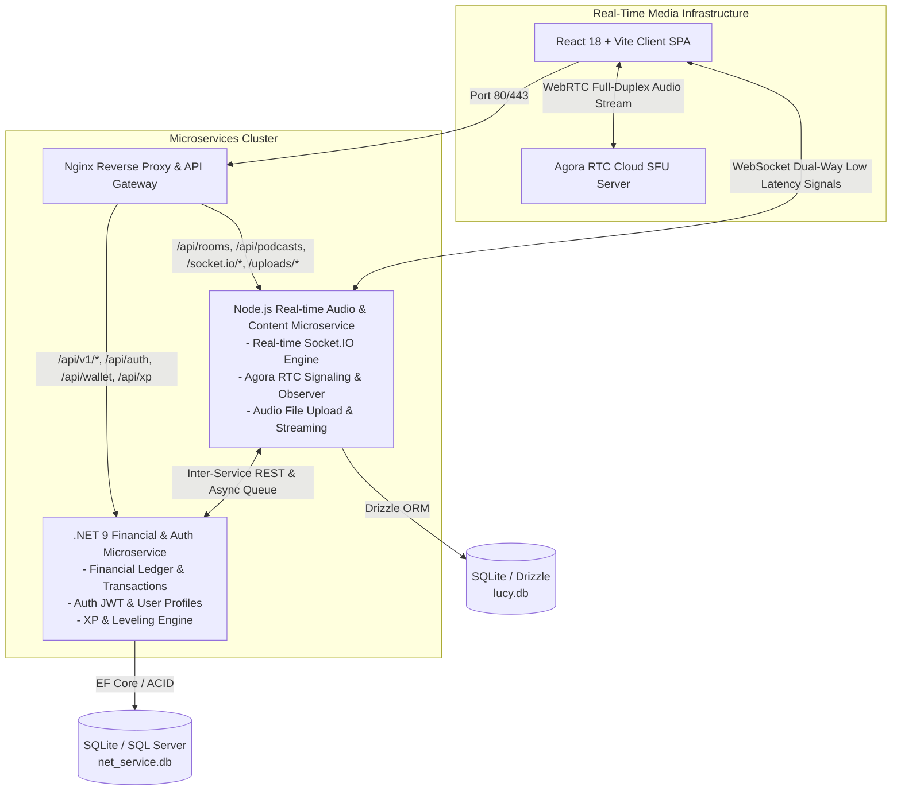

# BÁO CÁO PHÂN TÍCH VÀ THIẾT KẾ KIẾN TRÚC PHẦN MỀM (SOFTWARE ARCHITECTURE & DESIGN REPORT)
## Dự án: LUCY — Gamified Social Audio & Language Learning Platform
**Môn học**: SWD392 - Software Architecture and Design

---

## 1. TỔNG QUAN KIẾN TRÚC HỆ THỐNG (HIGH-LEVEL ARCHITECTURE)

Dự án **LUCY** ứng dụng kết hợp 2 phong cách kiến trúc hiện đại bậc nhất trong phát triển phần mềm:
1. **Kiến trúc Microservices đa ngôn ngữ (Polyglot Microservices Architecture)**.
2. **Kiến trúc Xử lý Thời gian thực hai kênh (Dual-Channel Real-Time Architecture)**.

---

## 2. PHÂN TÍCH CHI TIẾT THEO CÁC PHONG CÁCH KIẾN TRÚC CHÍNH

### 2.1. Kiến trúc Microservices (Microservices Architecture)

#### A. Cấu trúc các Microservices:
- **`net-service` (C# .NET 9 Microservice)**:
  - **Đảm nhận**: Quản lý Ví tiền, Nhật ký sổ kép (Ledger Transactions), Đổi quà (Gifts), Tích điểm XP, Mã hóa JWT Authentication.
  - **Lý do chọn .NET 9**: C# có tính đóng gói cao (Strongly Typed), Entity Framework Core hỗ trợ Transaction ACID nghiêm ngặt, thực thi thuật toán LINQ cực nhanh, bảo mật tuyệt đối cho dữ liệu tài chính.
- **`njs-service` (Node.js/TypeScript Microservice)**:
  - **Đảm nhận**: Quản lý các phòng học Live, Socket.IO Signaling Server, Khóa học 100 Level, Upload & Stream bài giảng Podcast, AI Speech Analytics.
  - **Lý do chọn Node.js**: Mô hình phi đồng bộ Single-Threaded Event Loop cho phép giữ hàng chục ngàn kết nối Socket.IO mở song song với lượng RAM rất nhỏ (<100MB).
- **`frontend` (React 18 SPA Microservice)**:
  - **Đảm nhận**: Giao diện người dùng thời gian thực, quản lý state tập trung via Zustand, tích hợp WebAudio API cho hiệu ứng âm thanh và sóng nhạc Visualizer.

#### B. Cơ chế Truyền thông giữa các Microservices (Inter-Service Communication):
1. **Synchronous Inter-Service REST API**: Node.js gọi trực tiếp sang .NET qua API `/api/xp/user/:id` để lấy điểm XP chính thức của người dùng.
2. **Asynchronous Retry Queue (Hàng chờ gởi lại bất đồng bộ)**: Khi ghi nhận XP từ phòng học sang .NET, nếu `net-service` gặp sự cố tải hoặc bảo trì, `njs-service` không làm đứt gãy phòng học mà tự động đưa payload vào hàng chờ `queueXpRecord` và thử lại định kỳ, đảm bảo **Fault Tolerance (Tính chịu lỗi)**.
3. **API Gateway Pattern (Nginx)**: Đóng vai trò điểm truy cập duy nhất (Single Entry Point), định tuyến thông minh (Smart Routing), ẩn toàn bộ cấu trúc địa chỉ IP/Port nội bộ của các microservice.

---

### 2.2. Kiến trúc Xử lý Thời gian thực & Tối ưu hóa Audio (Real-Time & Audio Streaming Architecture)

Hệ thống LUCY sử dụng **Mô hình Thời gian thực hai kênh (Dual-Channel Real-Time Pattern)** nhằm đảm bảo độ trễ tối thiểu và tránh hiện tượng giật lag âm thanh:

1. **Kênh Giao tiếp Thời gian thực (Signaling Channel - Socket.IO WebSocket)**:
   - Truyền tải các gói tin JSON siêu nhẹ để cập nhật trạng thái phòng học (giơ tay `hand-raise`, duyệt phát biểu `grant-speak`, bật tắt mic) với độ trễ **< 20ms**. 
   - Node.js không cần gánh dữ liệu media, giúp server nhẹ và hoạt động ổn định.

2. **Kênh Âm thanh thoại Đa chiều (Media Channel - Agora WebRTC SFU)**:
   - Luồng giọng nói đi trực tiếp từ trình duyệt Client đến hạ tầng đám mây phân tán **Agora WebRTC** theo kiến trúc **SFU (Selective Forwarding Unit)** với độ trễ **< 150ms**.
   - Tránh hoàn toàn hiện tượng nghẽn cổ chai CPU/băng thông trên server Node.js.

3. **Kênh Phát bài giảng tĩnh (Podcast Static Streaming via HTTP Range Requests - Partial Content 206)**:
   - Thay vì bắt học viên tải toàn bộ file bài giảng (`.wav` / `.mp3`) về bộ nhớ trước khi phát, hệ thống cấu hình Express static & Nginx hỗ trợ **Range Requests**.
   - Client gửi header `Range: bytes=...`, server phản hồi mã **`HTTP 206 Partial Content`** trả về đúng phân đoạn dữ liệu cần phát.
   - Nhờ vậy, học viên có thể **tua bài giảng (seeking) ngay lập tức** mà không có độ trễ buffering và không tốn RAM hệ thống.

---

### 2.3. So sánh và Lựa chọn Hệ quản trị Cơ sở Dữ liệu (Database Design & Decision Matrix)

Hệ thống sử dụng mô hình **Database per Service (Mỗi dịch vụ một Cơ sở Dữ liệu riêng biệt)** nhằm giảm tải và loại bỏ ràng buộc chéo (Tightly-coupled Schema):

| Đặc trưng | `.NET Service Database` (SQLite / SQL Server) | `Node.js Service Database` (SQLite / Drizzle ORM) |
| :--- | :--- | :--- |
| **Vai trò chính** | Quản lý Tài khoản (Users), Ví tiền (Wallet), Nhật ký giao dịch (Ledger Transactions). | Quản lý Phòng học (Rooms), Danh sách Podcast, Thông tin Cấp độ (Levels), Session học tập. |
| **Yêu cầu kỹ thuật** | **ACID chặt chẽ (Strong Consistency)**. Tuyệt đối không để xảy ra sai sót số dư. | **Tốc độ đọc/ghi nhanh (High Write-Throughput)** để phục vụ cập nhật trạng thái phòng học thời gian thực. |
| **Công nghệ truy cập** | Entity Framework Core (EF Core) | Drizzle ORM (TypeScript-first SQL Query Builder) |
| **Thiết kế tối ưu** | Sử dụng Ràng buộc Khóa ngoại chặt chẽ, Transactions cô lập cao. | Sử dụng các trường dữ liệu phi cấu trúc JSON (như `content_json` trong bảng levels) để lưu trữ nhanh các câu hỏi AI, mẹo ngữ pháp mà không cần nhiều bảng quan hệ phức tạp. |

#### *So sánh với Phương án cơ sở dữ liệu tập trung (Shared Database)*:
- **Lý do loại bỏ Shared DB**: Nếu cả hai Service cùng ghi/đọc chung một database, khi lượng người dùng nói chuyện real-time tăng cao, các câu lệnh INSERT/UPDATE phòng học liên tục của Node.js sẽ khóa bảng (Table Lock/Row Lock), dẫn đến treo hoặc gián đoạn các giao dịch ví tiền của .NET. Chia tách DB giúp cô lập lỗi (Fault Isolation) - nếu DB Real-time lỗi, Ví tiền vẫn hoạt động an toàn.

---

### 2.4. Phân tích Các Mẫu Thiết kế Hướng Kiến trúc (Architectural Design Patterns)

Dự án áp dụng các Design Pattern kinh điển giải quyết các bài toán cụ thể:

#### 1. Double-Entry Ledger Pattern (Mẫu Nhật ký sổ kép tài chính)
- **Áp dụng**: Hệ thống Ví tiền & Donate Creator. Mọi biến động số dư được ghi nhận dưới dạng 2 dòng đối ứng (Ghi nợ `Sender` - Ghi có `Recipient`) trong bảng `WalletLedger`.
- **So sánh với kiến trúc tương tự (Direct Mutation)**: Việc chỉ dùng `UPDATE Users SET Balance = Balance - X` sẽ phá hủy khả năng kiểm toán dòng tiền và dễ gây Race Condition. Nhật ký sổ kép giúp khôi phục dữ liệu ví 100% trong mọi tình huống sự cố.

#### 2. Finite State Machine Pattern (Máy trạng thái hữu hạn - FSM)
- **Áp dụng**: Quản lý vòng đời phòng học (`Lobby` $\rightarrow$ `Topic` $\rightarrow$ `Transition` $\rightarrow$ `Closed`).
- **So sánh với kiến trúc tương tự (Boolean Flags)**: Việc dùng nhiều cờ rời rạc (`isLive`, `isEnded`) rất dễ đưa phòng vào trạng thái lỗi logic (Invalid State). FSM định nghĩa rõ ràng điều kiện chuyển trạng thái, giúp hệ thống hoạt động chính xác tuyệt đối.

#### 3. Policy-Based Authorization Guard (Mẫu Lớp bảo vệ dựa trên chính sách)
- **Áp dụng**: Khóa phòng vượt cấp (Level Requirement Guard). Tính toán cấp độ dựa trên XP và áp dụng chính sách thử thách tối đa `UserLevel + 3`.
- **Lợi ích**: Bảo vệ trải nghiệm học viên mới không bị ngợp trong phòng nâng cao, đồng thời giải phóng quyền năng cho SUPER Host để giảng dạy.

---

## 3. BẢNG SO SÁNH MA TRẬN QUYẾT ĐỊNH KIẾN TRÚC (DECISION MATRIX)

| Tiêu chí | Kiến trúc Monolith Thuần túy | Microservices Thuần túy (Docker/Kubernetes) | **Mô hình Hybrid của LUCY (Lựa chọn)** |
| :--- | :--- | :--- | :--- |
| **Độ phức tạp hạ tầng** | Rất thấp | Rất cao (Cần DevOps/Service Mesh) | **Vừa phải** (Tận dụng Nginx Proxy) |
| **Tốc độ Real-time** | Trung bình | Tốt (dính độ trễ Inter-service) | **Cực cao** (Node.js + Socket.IO trực tiếp) |
| **Tính an toàn tài chính** | Khá | Cần Distributed Transactions (Saga) | **Tối ưu** (.NET 9 đảm nhận ACID Ledger) |
| **Khả năng bảo trì** | Giảm dần theo thời gian | Cao | **Rất cao** (Tách biệt công nghệ phù hợp) |

---

## 4. KẾT LUẬN

Kiến trúc phần mềm của dự án **LUCY** được thiết kế dựa trên sự thấu hiểu rõ nét về các ràng buộc phi chức năng (Non-functional Requirements). Việc chia tách dịch vụ đa ngôn ngữ (**C# .NET 9** bảo mật tiền tệ, **Node.js** tối ưu hóa I/O thời gian thực), áp dụng mô hình **Database per Service**, và tối ưu hóa **HTTP 206 Partial Content** đã giúp hệ thống đạt độ trễ cực thấp, trải nghiệm âm thanh mượt mà tuyệt đối và tính bảo mật vững chắc cho người dùng.
