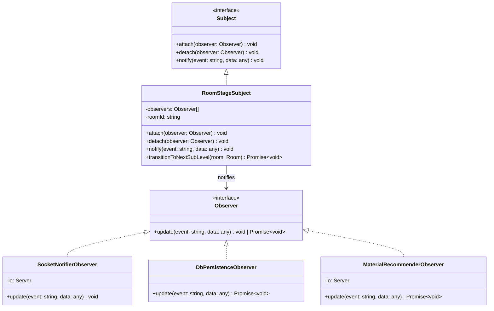

# BÁO CÁO NGHIÊN CỨU & ÁP DỤNG DESIGN PATTERNS
## Đề tài: Logic Chuyển Đổi Stage Tự Động Trong Hệ Thống LMS - Dự Án LUCY
### Học phần: SWD392 — Software Architecture & Design

---

## 1. Giới thiệu chung & Bối cảnh dự án

Dự án **LUCY** là nền tảng luyện nói ngoại ngữ thời gian thực dành cho Gen Z, ứng dụng mô hình gamification với lộ trình học tập gồm 100 levels chia làm 3 Stage chính (Sơ cấp, Trung cấp, Cao cấp). Mỗi level lại bao gồm 12 sub-levels tương đương với 12 mốc học tập nhỏ hơn.

Trong giai đoạn này, một trong những tính năng cốt lõi là **"Logic chuyển đổi Stage tự động"** của Node.js (`njs-service`):

- Mỗi **10 phút**, phòng học (`Room`) sẽ tự động tăng sub-level hiện tại (`currentSubLevel++`), tối đa 12 sub-levels.
- Khi chuyển đổi, trạng thái phòng chuyển từ `Active` sang `Transition` (trong 3 giây để người học chuẩn bị) rồi quay lại `Active`.
- Host cũng có thể kích hoạt chuyển Stage thủ công qua sự kiện `force-stage-transition`.
- Hệ thống cần đồng thời thực hiện hàng loạt hành vi:
  1. Gửi sự kiện WebSocket (`stage-changed`) tới tất cả học viên trong phòng để giao diện cập nhật.
  2. Ghi nhận tiến độ mới của phòng học vào cơ sở dữ liệu SQLite thông qua Drizzle ORM.
  3. Làm mới hoặc gợi ý tài liệu học tập LMS tương ứng với sub-level mới (từ vựng, câu hỏi gợi mở, ngữ pháp cốt lõi) và tự động cập nhật tài liệu ghim (`pinnedContent`).

---

## 2. Nghiên cứu lý thuyết Design Patterns (GoF)

Theo cuốn sách kinh điển của *Gang of Four (GoF)*, các mẫu thiết kế được chia làm 3 nhóm chính:

| Nhóm Pattern | Mục đích chính | Các Pattern tiêu biểu |
| :--- | :--- | :--- |
| **Creational** (Khởi tạo) | Giải quyết các vấn đề liên quan đến việc khởi tạo đối tượng, giúp che giấu logic tạo dựng và độc lập với cách đối tượng được tạo ra. | Singleton, Factory Method, Abstract Factory, Builder, Prototype. |
| **Structural** (Cấu trúc) | Giải quyết các vấn đề liên quan đến việc lắp ghép, liên kết giữa các class và object nhằm tạo nên các cấu trúc lớn hơn, linh hoạt hơn. | Adapter, Bridge, Composite, Decorator, Facade, Flyweight, Proxy. |
| **Behavioral** (Hành vi) | Tập trung vào việc phân bổ trách nhiệm, giao tiếp và tương tác giữa các đối tượng để tối ưu hóa luồng xử lý dữ liệu và thuật toán. | **Observer**, **State**, Strategy, Command, Iterator, Mediator, Memento, Template Method. |

---

## 3. Phân tích & Đề xuất Mẫu Thiết Kế từ AI (RBL)

### 3.1. Quá trình tham vấn AI (ChatGPT)

Theo yêu cầu RBL, nhóm phát triển đã tiến hành đặt câu hỏi tham vấn ChatGPT về giải pháp tối ưu cho tính năng chuyển đổi Stage tự động:

> **Prompt gửi AI:** *"Tôi có một dịch vụ Node.js quản lý phòng học audio real-time. Mỗi 10 phút phòng tự động tăng sublevel. Khi tăng sublevel, hệ thống cần gửi socket cho client, cập nhật DB, và cập nhật tài liệu gợi ý LMS. Tôi nên dùng Design Pattern nào để code sạch, tránh tight-coupling (phụ thuộc chặt)?"*

> **Kết quả gợi ý từ AI:**
> 1. **State Pattern:** Phù hợp để quản lý các trạng thái vòng đời của phòng (`Lobby -> Active -> Transition -> Closed`) và thay đổi cách phòng xử lý dữ liệu tương ứng với từng trạng thái.
> 2. **Observer Pattern (Publish-Subscribe):** Phù hợp nhất để giải quyết bài toán "khi một sự kiện xảy ra (Sub-level thay đổi), nhiều module độc lập cần phản hồi". Nó giúp tách biệt hoàn toàn logic đếm thời gian của phòng khỏi logic gửi socket, logic ghi DB và logic gợi ý tài liệu.
> 3. **Kết luận từ AI:** Nên dùng **Observer Pattern** làm kiến trúc chủ đạo cho hệ thống thông báo sự kiện, và có thể dùng **State Pattern** bên trong đối tượng Room để quản lý các chuyển đổi trạng thái nghiêm ngặt.

### 3.2. So sánh lựa chọn giải pháp: State vs. Observer Pattern

| Tiêu chí | State Pattern | Observer Pattern (Lựa chọn chính) |
| :--- | :--- | :--- |
| **Trọng tâm giải quyết** | Trạng thái nội bộ của một đối tượng và sự thay đổi hành vi tương ứng với trạng thái đó. | Sự đồng bộ và truyền tin giữa một đối tượng phát tin (Subject) và nhiều đối tượng nhận tin (Observers). |
| **Độ khớp bài toán** | Chỉ giải quyết được việc chuyển từ trạng thái `Active` sang `Transition` rồi về `Active`. Không tối ưu cho việc thêm các hành vi phụ (như ghi DB, đổi tài liệu). | Cực kỳ tối ưu. Khi Room phát ra tín hiệu "Level thay đổi", các Observer độc lập sẽ tự thực hiện nhiệm vụ của mình. |
| **Khả năng mở rộng (Open/Closed)** | Khi thêm hành vi mới khi chuyển sublevel (vd: cộng điểm học tập), ta phải sửa lại class Room hoặc các class State. | Chỉ cần viết thêm một class Observer mới và đăng ký vào Subject. Không cần sửa đổi bất kỳ dòng code hiện tại nào của Room. |
| **Mức độ ghép cặp (Coupling)** | Medium. Class Room vẫn cần biết về các đối tượng State. | Low (Loose Coupling). Room không cần biết các Observers là ai hay chúng làm gì, chỉ cần gọi hàm `update()`. |

**Quyết định thiết kế:** Áp dụng **Observer Pattern** làm mô hình chính để liên kết các hành vi tự động khi chuyển Stage.

---

## 4. Kiến trúc Hệ thống áp dụng Observer Pattern

### 4.1. Sơ đồ lớp (Mermaid Diagram)



### 4.2. Nguyên lý hoạt động

1. **`RoomStageSubject`**: Là đối tượng đại diện cho việc quản lý tiến trình phòng học. Mỗi phòng học khi được tạo sẽ sở hữu một instance của `RoomStageSubject`, lưu trong Map `activeRooms` (in-memory).
2. **Đăng ký Observers**: Khi khởi tạo phòng (`createRoomInMemory` trong `roomService.ts`), 3 concrete observers được đăng ký (`attach`) vào subject:
   - `SocketNotifierObserver` — gửi sự kiện thời gian thực qua Socket.io.
   - `DbPersistenceObserver` — ghi trạng thái phòng xuống SQLite qua Drizzle ORM.
   - `MaterialRecommenderObserver` — truy vấn nội dung level mới và tự động ghim tài liệu học tập.
3. **Kích hoạt tự động/thủ công**:
   - **Tự động**: Mỗi 10 phút, `setInterval` trong `createRoomInMemory` gọi `transitionToNextSubLevel()`.
   - **Thủ công**: Host gửi sự kiện `force-stage-transition`, backend gọi `forceNextSublevel()` → `subject.transitionToNextSubLevel()`.
4. **Phân phát xử lý**: `transitionToNextSubLevel()` tăng `currentSubLevel`, đặt `state = 'Transition'`, rồi gọi `notify('stage-changed', ...)`. Sau 3 giây, đặt `state = 'Active'` và gọi `notify('room-updated', ...)`. Mỗi Observer tự xử lý phần việc của mình:
   - `SocketNotifierObserver` nhận `stage-changed` → emit `stage-changed` + `room-updated` tới client.
   - `DbPersistenceObserver` nhận `stage-changed` → cập nhật `currentSubLevel` và `state` trong SQLite.
   - `MaterialRecommenderObserver` nhận `stage-changed` → query level content mới → auto-pin vocabulary + emit `ai-recommendation-updated`.

---

## 5. Minh họa cấu trúc Code triển khai (TypeScript)

### 5.1. Khởi tạo interface của Pattern (`observer.ts`)

```typescript
export interface Observer {
  update(event: string, data: any): void | Promise<void>;
}

export interface Subject {
  attach(observer: Observer): void;
  detach(observer: Observer): void;
  notify(event: string, data: any): void | Promise<void>;
}
```

### 5.2. Concrete Subject: Quản lý tiến trình phòng học (`observer.ts`)

```typescript
import { Observer, Subject } from './observer';
import { Room } from '../types/index.js';

export class RoomStageSubject implements Subject {
  private observers: Observer[] = [];
  private roomId: string;

  constructor(roomId: string) {
    this.roomId = roomId;
  }

  attach(observer: Observer): void {
    if (!this.observers.includes(observer)) {
      this.observers.push(observer);
    }
  }

  detach(observer: Observer): void {
    this.observers = this.observers.filter(obs => obs !== observer);
  }

  notify(event: string, data: any): void {
    for (const observer of this.observers) {
      Promise.resolve(observer.update(event, data)).catch(err => {
        console.error(`[Observer Error] Failed to update observer:`, err);
      });
    }
  }

  async transitionToNextSubLevel(room: Room): Promise<void> {
    if (room.currentSubLevel < 12) {
      room.currentSubLevel++;
      room.state = 'Transition';

      this.notify('stage-changed', { roomId: this.roomId, room });

      setTimeout(() => {
        room.state = 'Active';
        this.notify('room-updated', { roomId: this.roomId, room });
      }, 3000);
    }
  }
}
```

### 5.3. Các Concrete Observers phục vụ LMS (`observer.ts`)

**`SocketNotifierObserver`** — Gửi sự kiện WebSocket tới client đang kết nối:

```typescript
import { Server } from 'socket.io';
import { Room } from '../types/index.js';

export class SocketNotifierObserver implements Observer {
  private io: Server;

  constructor(io: Server) {
    this.io = io;
  }

  update(event: string, data: { roomId: string; room: Room }): void {
    const { roomId, room } = data;
    if (event === 'stage-changed') {
      this.io.to(roomId).emit('stage-changed', {
        roomId,
        newSubLevel: room.currentSubLevel,
        levelName: room.levelName,
      });
      this.io.to(roomId).emit('room-updated', { room });
    } else if (event === 'room-updated') {
      this.io.to(roomId).emit('room-updated', { room });
    }
  }
}
```

**`DbPersistenceObserver`** — Đồng bộ trạng thái mới xuống SQLite Database:

```typescript
import db from '../db/index.js';
import { rooms } from '../db/schema.js';
import { and, eq } from 'drizzle-orm';

export class DbPersistenceObserver implements Observer {
  async update(event: string, data: { roomId: string; room: Room }): Promise<void> {
    const { roomId, room } = data;
    if (event === 'stage-changed' || event === 'room-updated') {
      try {
        await db.update(rooms)
          .set({
            currentSubLevel: room.currentSubLevel,
            state: room.state,
          })
          .where(eq(rooms.id, roomId));
        console.log(`[DbPersistenceObserver] Persisted room ${roomId} - State: ${room.state}, Sub-level: ${room.currentSubLevel}`);
      } catch (err) {
        console.error(`[DbPersistenceObserver] Failed to update SQLite for room ${roomId}:`, err);
      }
    }
  }
}
```

**`MaterialRecommenderObserver`** — Tự động lấy dữ liệu bài học mới từ SQLite và gợi ý tài liệu:

```typescript
import { Server } from 'socket.io';
import db from '../db/index.js';
import { rooms, levels } from '../db/schema.js';
import { and, eq } from 'drizzle-orm';
import { Room, ContentPin } from '../types/index.js';
import { v4 as uuidv4 } from 'uuid';

export class MaterialRecommenderObserver implements Observer {
  private io: Server;

  constructor(io: Server) {
    this.io = io;
  }

  async update(event: string, data: { roomId: string; room: Room }): Promise<void> {
    const { roomId, room } = data;
    if (event === 'stage-changed') {
      try {
        const [startLevel] = await db.select().from(levels).where(eq(levels.id, room.levelId));
        if (!startLevel) return;

        const [nextLevel] = await db.select()
          .from(levels)
          .where(and(
            eq(levels.language, startLevel.language),
            eq(levels.stage, startLevel.stage),
            eq(levels.subLevel, room.currentSubLevel)
          ));

        if (nextLevel) {
          const content = JSON.parse(nextLevel.contentJson);

          // Auto-pin new vocabulary list
          const pin: ContentPin = {
            id: uuidv4(),
            title: `Vocabulary for Sub-level ${room.currentSubLevel}`,
            url: `Vocab: ${content.vocabulary.join(', ')}`,
            type: 'vocabulary',
            pinnedBy: room.hostId,
            pinnedAt: new Date().toISOString(),
          };

          room.pinnedContent = pin;

          // Emit updates to clients
          this.io.to(roomId).emit('pinned-content-updated', { roomId, pin });
          this.io.to(roomId).emit('ai-recommendation-updated', {
            roomId,
            recommendation: {
              vocabulary: content.vocabulary,
              conversationPrompts: content.conversationPrompts,
              grammarTips: content.grammarTips,
              aiSuggestedQuestions: content.aiSuggestedQuestions,
              levelName: nextLevel.name,
              levelId: nextLevel.id,
            },
          });
        }
      } catch (err) {
        console.error(`[MaterialRecommenderObserver] Failed to load level recommendations:`, err);
      }
    }
  }
}
```

### 5.4. Đăng ký Observers khi tạo phòng (`roomService.ts` — `createRoomInMemory`)

```typescript
import { RoomStageSubject, SocketNotifierObserver, DbPersistenceObserver, MaterialRecommenderObserver } from './observer.js';

export function createRoomInMemory(roomData: Omit<Room, 'id' | 'participants' | 'pinnedContent' | 'participantCount'>): string {
  const id = uuidv4();
  const fullRoom: Room = {
    ...roomData,
    id,
    participants: [],
    pinnedContent: null,
    participantCount: 0,
    createdAt: new Date().toISOString(),
  };

  // Tạo Subject và đăng ký 3 Observers
  const subject = new RoomStageSubject(id);
  subject.attach(new SocketNotifierObserver(ioInstance));
  subject.attach(new DbPersistenceObserver());
  subject.attach(new MaterialRecommenderObserver(ioInstance));

  // Timer tự động chuyển Stage mỗi 10 phút
  const stageTimer = setInterval(async () => {
    const rd = activeRooms.get(id);
    if (!rd || rd.room.state === RoomState.CLOSED) {
      clearInterval(stageTimer);
      return;
    }
    await rd.subject?.transitionToNextSubLevel(rd.room);
  }, 10 * 60 * 1000);

  activeRooms.set(id, { room: fullRoom, stageTimer, subject, handQueue: [] });
  return id;
}
```

---

## 6. Đánh giá tính hiệu quả thực tế

Việc áp dụng **Observer Pattern** mang lại các cải tiến kiến trúc vượt trội so với phiên bản viết procedural/ tightly-coupled:

1. **Tuân thủ chặt chẽ Nguyên lý Single Responsibility (SRP):**
   - `RoomStageSubject` chỉ quản lý việc thông báo sự kiện, không biết Observer nào đang lắng nghe hay chúng làm gì.
   - Mỗi Observer chỉ làm đúng một việc: gửi socket, ghi DB, hoặc gợi ý học liệu.
   - `roomService.ts` chỉ phụ trách routing sự kiện Socket, không chứa logic nghiệp vụ chuyển Stage.

2. **Mở rộng dễ dàng (Open/Closed Principle - OCP):**
   - Nếu trong tương lai cần thêm tính năng "Tặng xu thưởng khi vượt cấp", chỉ cần tạo `RewardObserver` implements `Observer` và `subject.attach(new RewardObserver(...))`. Không cần sửa đổi bất kỳ dòng code của `RoomStageSubject` hay các Observer hiện có.

3. **Hỗ trợ tối ưu cho kiểm thử (Testability):**
   - Có thể mock `Observer` và kiểm tra xem `RoomStageSubject.notify()` có gọi đúng số observer và đúng event name hay không.
   - Có thể test từng Observer độc lập: giả lập `data` và kiểm tra kết quả emit/DB update mà không cần server thật.

4. **Loose Coupling thực tế:**
   - `RoomStageSubject` phụ thuộc vào interface `Observer`, không phụ thuộc vào concrete class.
   - Các Observer có thể được thêm/bớt linh hoạt mà không ảnh hưởng đến Subject.
   - `MaterialRecommenderObserver` và `DbPersistenceObserver` là `async`, trong khi `SocketNotifierObserver` là sync — `notify()` xử lý cả hai loại nhờ `Promise.resolve()`, minh họa tính linh hoạt của interface.

5. **Xử lý lỗi tập trung:**
   - `notify()` wrapped mỗi `observer.update()` trong `Promise.resolve().catch()`, đảm bảo một Observer lỗi không làm crash toàn bộ chuỗi thông báo.
