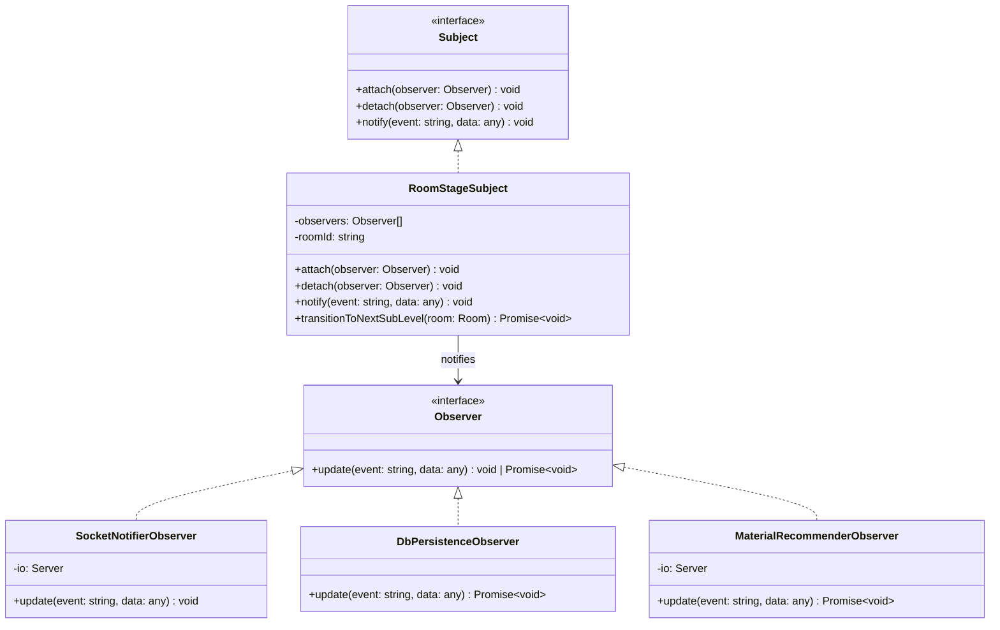

# BÁO CÁO NGHIÊN CỨU & ÁP DỤNG DESIGN PATTERNS TRONG TOÀN BỘ HỆ THỐNG LUCY

## Đề tài: Phân Tích & Đánh Giá Kiến Trúc Áp Dụng Mẫu Thiết Kế (Design Patterns)
### Học phần: SWD392 — Software Architecture & Design

---

## 1. Giới thiệu tổng quan hệ thống LUCY & Kiến trúc Microservices

Dự án **LUCY** (Language Unity & Collaborative Youth) là nền tảng luyện nói ngoại ngữ thời gian thực dành cho thế hệ Gen Z, ứng dụng mô hình gamification với lộ trình học tập gồm 100 levels chia làm 3 Stage chính (Beginner, Intermediate, Advanced). Mỗi level bao gồm 12 sub-levels tương đương với các mốc học tập nhỏ hơn được cập nhật liên tục.

Hệ thống được thiết kế theo mô hình **Microservices** phân tán gọn nhẹ để đảm bảo tính sẵn sàng cao, chia làm 4 thành phần chính:
1. **React Frontend (Vite + TypeScript):** Giao diện Single Page Application (SPA), tích hợp Agora RTC SDK để truyền tải âm thanh thời gian thực chất lượng cao.
2. **.NET Identity & Payment Service (Port 5001):** Quản lý định danh (JWT Auth), phân quyền vai trò (LUCY, Pro, Super), ví điện tử và giao dịch tặng quà ảo (Gifts) sử dụng SQLite (EF Core).
3. **Node.js Real-time & LMS Service (Port 3001):** Quản lý kết nối Socket.io, tạo phòng học, tự động hóa tiến trình học tập (LMS), sinh Agora Token, quản lý podcast ghi âm, sử dụng SQLite (Drizzle ORM).
4. **Nginx Reverse Proxy:** Điều hướng động và phân giải CORS, cùng Docker & Supervisord quản lý vận hành container.

Để giải quyết các bài toán về liên kết lỏng (loose coupling), mở rộng tính năng không cần sửa code cũ (OCP), và tối ưu hóa trải nghiệm người dùng, nhóm phát triển đã áp dụng nhiều **Design Patterns (Mẫu thiết kế GoF)** vào cả Backend lẫn Frontend.

---

## 2. Tổng hợp các Design Patterns áp dụng trong dự án

Dưới đây là bảng tổng hợp các Design Patterns đã được nghiên cứu và đưa vào triển khai thực tế trong mã nguồn dự án LUCY:

| Nhóm Pattern | Pattern Áp Dụng | Vị Trí Triển Khai | Mục Đích & Vai Trò |
| :--- | :--- | :--- | :--- |
| **Behavioral** (Hành vi) | **Observer Pattern** | `njs-service/src/services/observer.ts` & `roomService.ts` | Quản lý logic tự động chuyển Stage của phòng học (mỗi 10 phút) để kích hoạt đồng thời các nhiệm vụ: gửi Socket cho client, ghi DB SQLite, cập nhật tài liệu học liệu mới. |
| **Behavioral** (Hành vi) | **Strategy Pattern** | `njs-service/src/services/aiService.ts` | Đổi chiến lược sinh gợi ý học liệu (AI Recommendation) linh hoạt: Gọi trực tiếp API Gemini 2.5 Flash nếu cấu hình API Key, hoặc sử dụng bộ quy luật Keyword-based offline nếu chạy nội bộ không có kết nối ngoài. |
| **Creational** (Khởi tạo) | **Singleton Pattern** | `njs-service/src/db/index.ts` & `roomService.ts` | Đảm bảo kết nối cơ sở dữ liệu SQLite (Drizzle) duy nhất và danh sách quản lý phòng học in-memory (`activeRooms`) hoạt động nhất quán, không xảy ra xung đột tài nguyên. |
| **Creational** (Khởi tạo) | **Factory Method** | `njs-service/src/controllers/roomController.ts` | Sử dụng `RtcTokenBuilder` của Agora SDK như một Factory tạo các Token bảo mật truy cập kênh thoại một cách tự động và đồng bộ. |
| **Structural** (Cấu trúc) | **Repository Pattern** | `.NET Service` & `njs-service` (Drizzle ORM) | Che giấu chi tiết truy vấn cơ sở dữ liệu vật lý (SQL raw), cung cấp giao diện lập trình hướng đối tượng (Entity/Schema) sạch cho tầng nghiệp vụ. |
| **Structural** (Cấu trúc) | **MVC (Model-View-Controller)** | `.NET Service` & `njs-service` | Tổ chức mã nguồn phân tầng rõ rệt: Routes định tuyến, Controllers xử lý logic nghiệp vụ và nhận/trả dữ liệu REST, Frontend đảm nhận tầng View hiển thị. |

---

## 3. Chi tiết áp dụng Behavioral Pattern: Observer Pattern

### 3.1. Bài toán thực tế
Mỗi phòng học thoại trong LUCY hoạt động theo thời gian biểu nghiêm ngặt: mỗi 10 phút tự động nâng sub-level (`currentSubLevel++`). Khi có sự kiện chuyển sub-level này xảy ra, hệ thống cần kích hoạt 3 hành động độc lập:
1. Gửi sự kiện thời gian thực tới tất cả các client học viên trong phòng qua Socket.io để đổi giao diện.
2. Ghi nhận sub-level và trạng thái phòng mới vào SQLite Database nhằm duy trì trạng thái khi khởi động lại.
3. Tìm kiếm học liệu tương ứng sub-level mới từ DB, tự động ghim từ vựng cốt lõi lên góc phòng, và phát đi các câu hỏi thảo luận cập nhật.

Nếu viết theo kiểu tuần tự (Procedural), mã nguồn quản lý phòng sẽ phụ thuộc chặt (tight coupling) vào các module Socket, Database, và LMS. Khi muốn thêm tính năng thứ 4 (ví dụ: cộng điểm cho học viên khi qua sub-level mới), lập trình viên bắt buộc phải sửa code của hàm quản lý phòng, tăng nguy cơ lỗi hệ thống.

### 3.2. Sơ đồ lớp (Class Diagram)



### 3.3. Hiện thực mã nguồn cụ thể (TypeScript)

**Khởi tạo Interface (`observer.ts`):**
```typescript
export interface Observer {
  update(event: string, data: any): void | Promise<void>;
}

export interface Subject {
  attach(observer: Observer): void;
  detach(observer: Observer): void;
  notify(event: string, data: any): void | Promise<void>;
}
```

**Concrete Subject quản lý tiến trình phòng học (`RoomStageSubject`):**
```typescript
export class RoomStageSubject implements Subject {
  private observers: Observer[] = [];
  private roomId: string;

  constructor(roomId: string) {
    this.roomId = roomId;
  }

  attach(observer: Observer): void {
    if (!this.observers.includes(observer)) this.observers.push(observer);
  }

  detach(observer: Observer): void {
    this.observers = this.observers.filter(obs => obs !== observer);
  }

  notify(event: string, data: any): void {
    for (const observer of this.observers) {
      Promise.resolve(observer.update(event, data)).catch(err => {
        console.error(`[Observer Error] Failed to update observer:`, err);
      });
    }
  }

  async transitionToNextSubLevel(room: Room): Promise<void> {
    if (room.currentSubLevel < 12) {
      room.currentSubLevel++;
      room.state = 'Transition'; // Trạng thái đệm 3s trước khi học tiếp

      this.notify('stage-changed', { roomId: this.roomId, room });

      setTimeout(() => {
        room.state = 'Active';
        this.notify('room-updated', { roomId: this.roomId, room });
      }, 3000);
    }
  }
}
```

**Các Concrete Observers triển khai nhiệm vụ chuyên biệt:**
1. `SocketNotifierObserver` - Phát WebSocket:
```typescript
export class SocketNotifierObserver implements Observer {
  private io: Server;
  constructor(io: Server) { this.io = io; }

  update(event: string, data: { roomId: string; room: Room }): void {
    const { roomId, room } = data;
    if (event === 'stage-changed') {
      this.io.to(roomId).emit('stage-changed', {
        roomId,
        newSubLevel: room.currentSubLevel,
        levelName: room.levelName,
      });
    }
    this.io.to(roomId).emit('room-updated', { room });
  }
}
```

2. `DbPersistenceObserver` - Lưu trữ xuống SQLite:
```typescript
export class DbPersistenceObserver implements Observer {
  async update(event: string, data: { roomId: string; room: Room }): Promise<void> {
    const { roomId, room } = data;
    if (event === 'stage-changed' || event === 'room-updated') {
      await db.update(rooms)
        .set({ currentSubLevel: room.currentSubLevel, state: room.state })
        .where(eq(rooms.id, roomId));
    }
  }
}
```

3. `MaterialRecommenderObserver` - Tự động tải học liệu và đổi Pinned Content:
```typescript
export class MaterialRecommenderObserver implements Observer {
  private io: Server;
  constructor(io: Server) { this.io = io; }

  async update(event: string, data: { roomId: string; room: Room }): Promise<void> {
    const { roomId, room } = data;
    if (event === 'stage-changed') {
      const [nextLevel] = await db.select().from(levels).where(and(
        eq(levels.language, room.language),
        eq(levels.subLevel, room.currentSubLevel)
      ));
      if (nextLevel) {
        const content = JSON.parse(nextLevel.contentJson);
        const pin: ContentPin = {
          id: uuidv4(),
          title: `Vocabulary for Sub-level ${room.currentSubLevel}`,
          url: `Vocab: ${content.vocabulary.join(', ')}`,
          type: 'vocabulary',
          pinnedBy: room.hostId,
          pinnedAt: new Date().toISOString()
        };
        room.pinnedContent = pin;
        this.io.to(roomId).emit('pinned-content-updated', { roomId, pin });
        this.io.to(roomId).emit('ai-recommendation-updated', {
          roomId,
          recommendation: { ...content, levelName: nextLevel.name, levelId: nextLevel.id }
        });
      }
    }
  }
}
```

**Đăng ký và chạy tự động trong `roomService.ts`:**
```typescript
const subject = new RoomStageSubject(roomId);
subject.attach(new SocketNotifierObserver(ioInstance));
subject.attach(new DbPersistenceObserver());
subject.attach(new MaterialRecommenderObserver(ioInstance));

const stageTimer = setInterval(async () => {
  await subject.transitionToNextSubLevel(room);
}, 10 * 60 * 1000);
```

### 3.4. Áp dụng Pub-Sub/Observer trên Frontend (Zustand Store)
Ở Frontend, các React component không trực tiếp gọi API hay lắng nghe Socket thô. Thay vào đó, nền tảng sử dụng **Zustand** để triển khai mô hình **Publish-Subscribe**.
* Cửa hàng trạng thái `useRoomStore` đóng vai trò là nơi lưu trữ tập trung.
* Khi có sự kiện `pinned-content-updated` hay `ai-recommendation-updated` từ socket, Store sẽ cập nhật dữ liệu.
* Các component giao diện (`AgoraRoom`, `SpeakingRoomPage`) đóng vai trò là các subscriber đăng ký lắng nghe thay đổi của store. Khi store phát đi thông báo thay đổi, các component này tự động kết xuất lại (re-render) để cập nhật giao diện mà không cần can thiệp thủ công.

---

## 4. Chi tiết áp dụng Behavioral Pattern: Strategy Pattern (AI Recommendation Engine)

### 4.1. Bài toán thực tế
Nhằm mục đích tối ưu hóa việc học, hệ thống LUCY cho phép Host ghim (pin) các tài liệu học tập tùy chọn (như file `.txt`, `.docx`, `.pdf`, hoặc một từ vựng, đường dẫn tài liệu). Khi tài liệu được ghim, AI Recommender cần đưa ra các gợi ý:
* 4-6 từ vựng/cụm từ liên quan kèm phiên âm/nghĩa tiếng Việt.
* 2-3 cấu trúc ngữ pháp có thể áp dụng.
* 3-4 chủ đề thảo luận nhóm.
* 3-4 câu hỏi luyện nói tương tác.

Yêu cầu đặt ra là hệ thống phải hỗ trợ gọi API trực tiếp tới mô hình ngôn ngữ lớn tiên tiến (Google Gemini 2.5 Flash) để phân tích tài liệu chuyên sâu. Tuy nhiên, khi hệ thống chạy trong môi trường cục bộ (Offline), không có API Key, hoặc API bị giới hạn lưu lượng, hệ thống vẫn phải hoạt động bình thường bằng một giải pháp thay thế nội bộ thông minh dựa trên bộ quy tắc từ khóa (Keyword-based mapping).

### 4.2. Giải pháp áp dụng Strategy Pattern
Strategy Pattern được sử dụng để đóng gói hai chiến lược sinh gợi ý học liệu khác nhau:
1. **GeminiApiStrategy:** Thực hiện gọi HTTP POST đến API của Google Gemini, gửi kèm nội dung/tiêu đề của tài liệu để AI sinh cấu trúc dữ liệu JSON chính xác.
2. **LocalSmartRulesStrategy:** Thực hiện bóc tách từ khóa trong tiêu đề/mô tả tài liệu để tìm kiếm chủ đề tương đồng (Travel, Business, Food, Shopping, Daily Life) trong cơ sở dữ liệu mẫu đa ngôn ngữ (EN, ZH, JA) được dịch nghĩa chi tiết sang tiếng Việt.

Tầng nghiệp vụ gọi hàm (`generateRecommendationsFromPin`) không cần quan tâm chiến lược nào đang được thực hiện. Nó chỉ cần truyền tài liệu vào và nhận kết quả đầu ra. Việc chuyển đổi giữa các chiến lược được quyết định động thông qua sự tồn tại của cấu hình biến môi trường `GEMINI_API_KEY`.

### 4.3. Hiện thực mã nguồn cụ thể (`aiService.ts`)

```typescript
export async function generateRecommendationsFromPin(pin: ContentPin, language: Language): Promise<AiRecommendation> {
  const context = await getPinTextContext(pin);
  const geminiKey = process.env.GEMINI_API_KEY;

  // Chiến lược 1: Gọi API Gemini nếu có API Key cấu hình
  if (geminiKey) {
    try {
      const prompt = `Based on this pinned document:\n${context}...\nReturn a JSON object containing vocabulary, grammarTips, conversationPrompts, aiSuggestedQuestions...`;
      const response = await fetch(`https://generativelanguage.googleapis.com/v1beta/models/gemini-2.5-flash:generateContent?key=${geminiKey}`, {
        method: 'POST',
        headers: { 'Content-Type': 'application/json' },
        body: JSON.stringify({
          contents: [{ parts: [{ text: prompt }] }],
          generationConfig: { responseMimeType: 'application/json', temperature: 0.7 }
        })
      });

      if (response.ok) {
        const data = await response.json();
        const text = data.candidates?.[0]?.content?.parts?.[0]?.text;
        if (text) return JSON.parse(text) as AiRecommendation;
      }
    } catch (err) {
      console.error('[aiService] Failed to generate via Gemini, falling back to smart local rules:', err);
    }
  }

  // Chiến lược 2 (Fallback): Sử dụng bộ quy tắc từ khóa cục bộ
  return generateFallbackRecommendations(pin, language);
}
```

Chiến lược 2 (`generateFallbackRecommendations`) hoạt động dựa trên các bộ dữ liệu mẫu khổng lồ được xây dựng sẵn trong mã nguồn. Ví dụ, nếu tiêu đề ghim chứa các từ khóa liên quan đến du lịch như `travel`, `flight`, `hotel`, hệ thống sẽ trả về bộ từ vựng và câu hỏi về chủ đề du lịch phù hợp với ngôn ngữ của phòng học (tiếng Anh, Trung hoặc Nhật).

---

## 5. Chi tiết áp dụng Creational Patterns

### 5.1. Singleton Pattern
**Mục đích:** Hạn chế việc tạo ra nhiều thực thể cho cùng một tài nguyên dùng chung, ngăn chặn rò rỉ bộ nhớ, xung đột truy cập ghi file đồng thời trên SQLite, và đảm bảo tính nhất quán dữ liệu.
* **Database Connection Singleton (`db/index.ts`):** 
  Khởi tạo kết nối duy nhất đến file SQLite thông qua `better-sqlite3` và xuất ra instance `db` dùng chung cho toàn bộ ứng dụng:
  ```typescript
  const sqlite = new Database(dbPath);
  sqlite.pragma('journal_mode = WAL'); // Bật tính năng ghi nhật ký WAL tối ưu hóa hiệu suất
  export const db = drizzle(sqlite, { schema });
  export default db;
  ```
* **Active Room Memory Registry (`roomService.ts`):** 
  Sử dụng một thực thể Map duy nhất `activeRooms` để theo dõi toàn bộ trạng thái in-memory của các phòng chat đang hoạt động:
  ```typescript
  const activeRooms = new Map<string, {
    room: Room;
    stageTimer?: NodeJS.Timeout;
    subject?: RoomStageSubject;
  }>();
  ```
  Tất cả các luồng xử lý socket kết nối đều truy xuất đến Map Singleton này để đảm bảo đồng bộ hóa.

### 5.2. Factory Method Pattern
**Mục đích:** Đóng gói quá trình khởi tạo các đối tượng phức tạp có các tham số bảo mật thay đổi theo thời gian thực.
* **Agora Access Token Generator:**
  Khi một học viên hoặc khách truy cập tham gia vào kênh âm thanh, hệ thống cần cấp một token thoại có thời hạn sử dụng. Nền tảng sử dụng Factory `RtcTokenBuilder.buildTokenWithUid` của SDK Agora để sinh token:
  ```typescript
  const token = RtcTokenBuilder.buildTokenWithUid(
    appId,
    appCredential,
    channelName,
    uid,
    RtcRole.PUBLISHER,
    expireSec,
    expireSec
  );
  ```
  Hàm này che giấu toàn bộ logic mã hóa chữ ký HMAC-SHA1 phức tạp của Agora.
* **Avatars Persona Generator:**
  LUCY áp dụng thiết kế ẩn danh bằng cách sinh ngẫu nhiên 5 kiểu dải màu gradient cho các tài khoản đăng ký mới hoặc tài khoản khách (Guest). Quá trình ánh xạ gradient này được đóng gói trong một file hằng số đóng vai trò là một Factory ánh xạ đơn giản từ ID màu sang class CSS Tailwind (`PERSONA_GRADIENTS`).

---

## 6. Chi tiết áp dụng Structural Patterns: Repository Pattern & MVC

### 6.1. Repository Pattern (Drizzle ORM & EF Core)
Cả hai dịch vụ Node.js và .NET đều áp dụng **Repository Pattern** thông qua các ORM hiện đại (Drizzle và Entity Framework Core).
* Lập trình viên không trực tiếp viết mã SQL thuần như `SELECT * FROM rooms WHERE id = ...`.
* Thay vào đó, việc tương tác với DB được thực hiện qua các thực thể (entities):
  ```typescript
  // Node.js Drizzle ORM
  await db.select().from(rooms).where(eq(rooms.id, roomId));
  ```
  ```csharp
  // .NET EF Core
  var user = await db.Users.FirstOrDefaultAsync(u => u.Email == req.Email);
  ```
Thiết kế này giúp tách biệt hoàn toàn Tầng Nghiệp vụ (Business Logic) khỏi Tầng Truy cập Dữ liệu (Data Access Layer), giúp dễ dàng thay thế hệ quản trị cơ sở dữ liệu (ví dụ chuyển từ SQLite sang PostgreSQL) mà không phải viết lại code nghiệp vụ.

### 6.2. MVC (Model-View-Controller)
Dự án áp dụng chặt chẽ mô hình kiến trúc phân tầng MVC:
* **Model:** Định nghĩa cấu trúc dữ liệu (`db/schema.ts` trong Node.js và thư mục `Models/` trong .NET).
* **View:** Đảm nhận bởi React Single Page Application ở Frontend. Nhận dữ liệu JSON từ API và render thành giao diện Cyberpunk rực rỡ, sử dụng TailwindCSS và Framer Motion.
* **Controller:** Các Controller (`AuthController.cs`, `UsersController.cs` ở .NET và `roomController.ts`, `levelController.ts` ở Node.js) nhận request HTTP, kiểm tra hợp lệ, gọi tầng nghiệp vụ để thực hiện xử lý dữ liệu và trả về JSON thuần cho View.

---

## 7. Đánh giá hiệu quả kiến trúc thực tế

Việc áp dụng đồng bộ các Design Patterns kể trên đã mang lại các cải tiến kỹ thuật rõ rệt cho dự án LUCY:

1. **Tuân thủ Nguyên lý Đơn nhiệm (SRP - Single Responsibility Principle):**
   Mỗi class chỉ giải quyết một mối quan tâm duy nhất. `RoomStageSubject` chịu trách nhiệm kích hoạt thời gian chuyển sub-level, trong khi các Observers lo liệu việc gửi thông báo, ghi database hoặc gợi ý tài liệu học. Việc thêm bớt chức năng không làm ảnh hưởng đến các thành phần khác.
2. **Mở rộng dễ dàng (OCP - Open/Closed Principle):**
   Strategy Pattern cho phép cấu hình linh hoạt cách thức sinh câu hỏi/tài liệu của AI mà không cần viết lại logic ghim tài liệu. Observer Pattern cho phép dễ dàng cắm thêm các tính năng phân tích kết thúc phòng học, trao quà tự động bằng cách viết thêm class Observer mới và gọi hàm `attach()`.
3. **Nâng cao khả năng kiểm thử (Testability):**
   Việc tách biệt các Strategy và Observers giúp viết các bộ kiểm thử đơn vị (Unit Tests) vô cùng dễ dàng. Chúng ta có thể kiểm thử độc lập logic sinh từ khóa của Strategy ngoại tuyến hoặc kiểm thử giả lập các sự kiện thay đổi database mà không cần chạy máy chủ Socket thực tế.
4. **Giảm thiểu liên kết (Loose Coupling):**
   Tầng giao tiếp Socket, Database, và API AI được kết nối với lõi hệ thống thông qua các Interface trừu tượng. Việc thay đổi thư viện Socket, cập nhật cơ sở dữ liệu hay nâng cấp phiên bản mô hình AI (từ Gemini sang GPT) có thể được thực hiện độc lập, giúp dự án duy trì được tốc độ phát triển nhanh và khả năng bảo trì bền vững.
