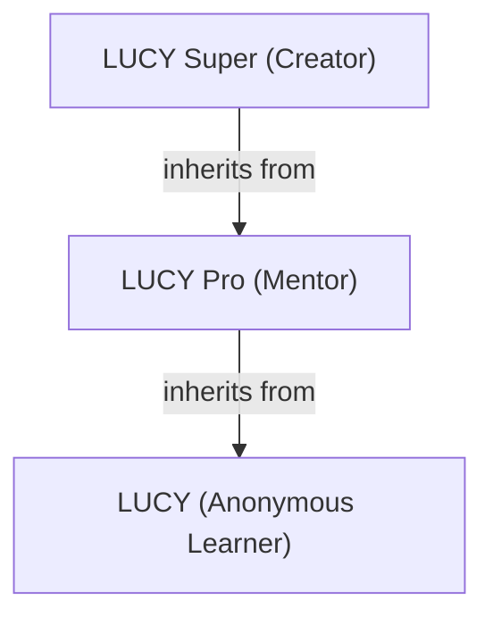
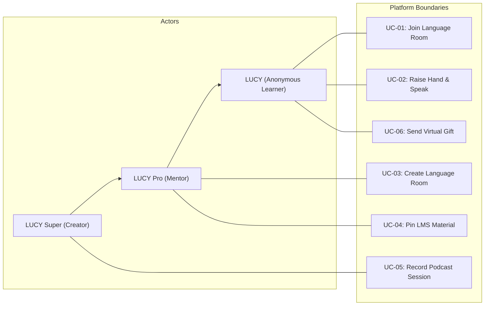
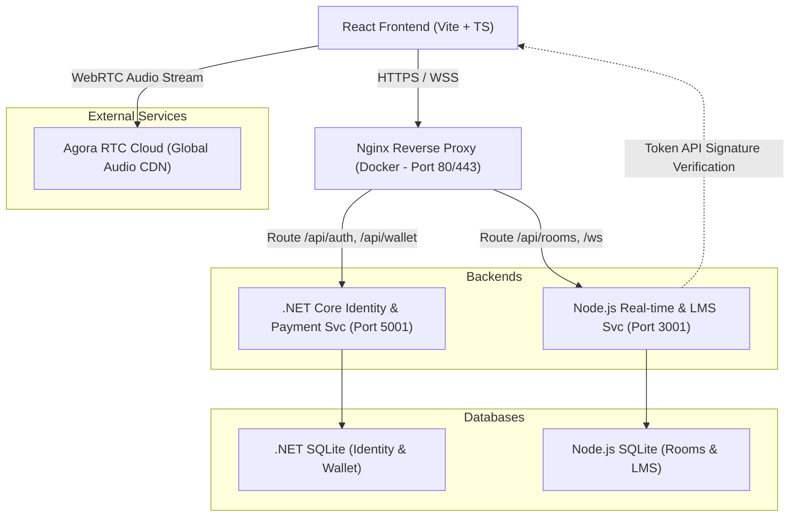
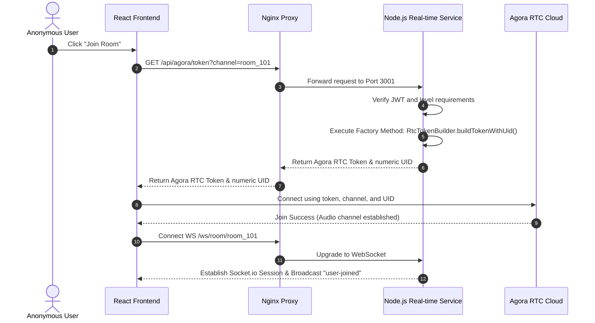
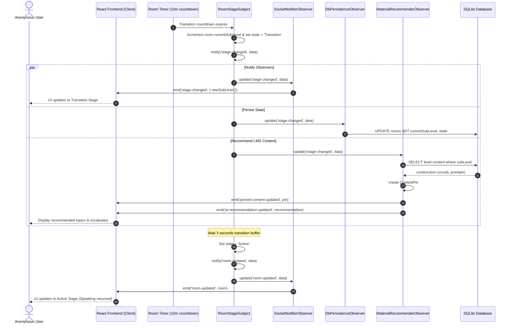
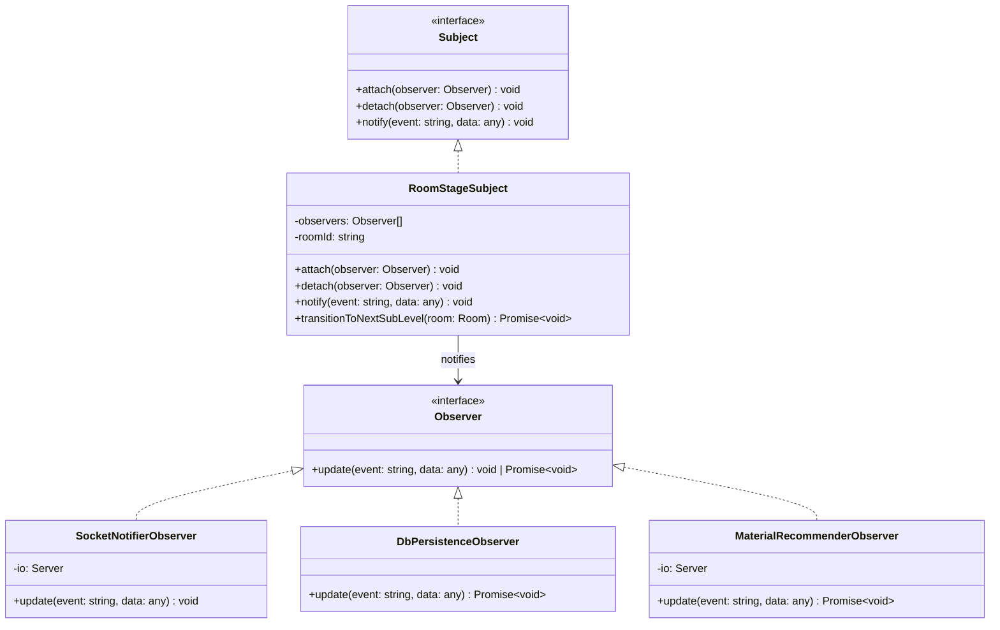
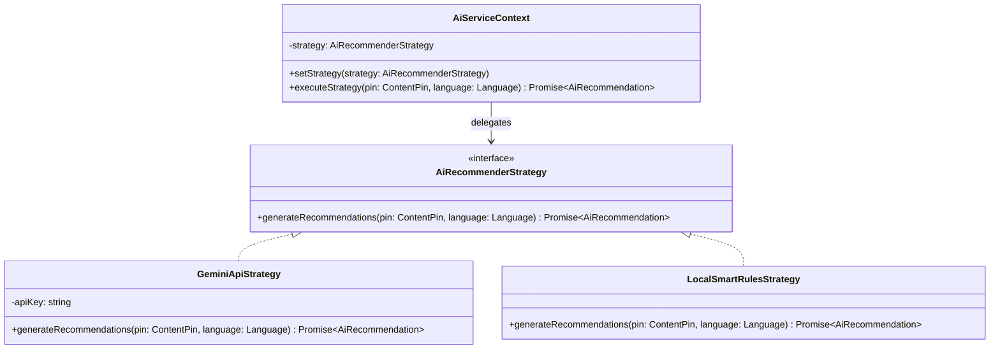
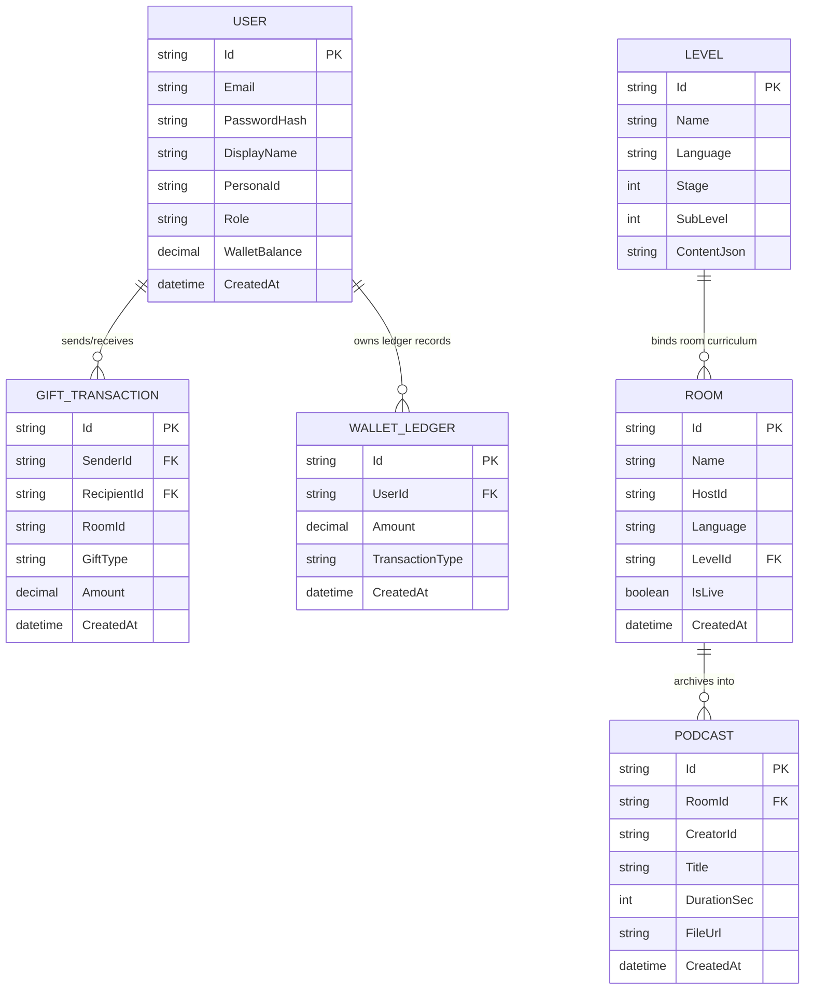

# FINAL PROJECT REPORT
**Project:** LUCY (Language Unity & Collaborative Youth)  
**Course:** SWD392 — Software Architecture & Design  
**Team:** Group 5  
**Instructor:** [Instructor Name]  
**Semester:** Summer 2026  
**Submission Date:** Jul 12, 2026  

---

## TABLE OF CONTENTS
1. [PART 1: PROJECT OVERVIEW — LUCY](#part-1-project-overview--lucy)
   - 1.1. Project Context
   - 1.2. Project Objectives
   - 1.3. User Model (Actor & Role Hierarchy)
2. [PART 2: REQUIREMENTS ANALYSIS — STAGE 1](#part-2-requirements-analysis--stage-1)
   - 2.1. Actor Generalization (Inheritance)
   - 2.2. Role-Based Feature Tiers
   - 2.3. Data Type Design Analysis
   - 2.4. Core Use Case Diagram
   - 2.5. Detailed Use Case Summary & Descriptions (UC-01 to UC-06)
3. [PART 3: REAL-TIME ARCHITECTURE — STAGE 2](#part-3-real-time-architecture--stage-2)
   - 3.1. Microservices System Architecture
   - 3.2. Real-time Audio Infrastructure
   - 3.3. Core System Sequence Diagrams
4. [PART 4: DESIGN PATTERNS APPLICATION — STAGE 3](#part-4-design-patterns-application--stage-3)
   - 4.1. Pattern Summary Matrix
   - 4.2. Observer Pattern: Automated Sub-level Orchestration
   - 4.3. Strategy Pattern: Resilient AI Recommender Engine
   - 4.4. Creational Patterns (Singleton & Factory Method)
   - 4.5. Structural Patterns (Repository & MVC)
5. [PART 5: SERVICE ARCHITECTURE & MONETIZATION — STAGE 4](#part-5-service-architecture--monetization--stage-4)
   - 5.1. SOA Principles & REST API Contracts
   - 5.2. Digital Wallet & Virtual Gifts (.NET Core Integration)
   - 5.3. Database Schema & Entity Relationship Diagram (ERD)
6. [PART 6: STRESS TESTING & EVALUATION — STAGE 5](#part-6-stress-testing--evaluation--stage-5)
   - 6.1. Stress Testing Setup & Objectives
   - 6.2. Performance Metrics & Results
   - 6.3. Implementation Timeline
7. [PART 7: CONCLUSION & LESSONS LEARNED](#part-7-conclusion--lessons-learned)
   - 7.1. Executive Summary
   - 7.2. Lessons Learned
   - 7.3. Future Roadmap

---

## PART 1: PROJECT OVERVIEW — LUCY

### 1.1. Project Context
**LUCY** (Language Unity & Collaborative Youth) is a specialized audio-based social networking platform integrated with EdTech. It is engineered to support Gen Z and younger demographics in overcoming psychological barriers—such as performance anxiety and social judgment—associated with traditional language learning. 

Traditional education often emphasizes grading and error correction, leading to speaking anxiety. LUCY creates a safe, low-pressure, gaming-inspired environment. By combining anonymous voice rooms, procedural avatar generation, a structured 100-level learning progression, and real-time interaction, LUCY turns practicing English, Chinese, or Japanese into an engaging, collaborative experience.

### 1.2. Project Objectives
*   **Anonymity & Confidence:** Mitigate language learning anxiety by utilizing virtual avatars to preserve identity, ensuring learners can make mistakes without fear of judgment.
*   **Collaborative Education:** Promote peer-to-peer language practice through real-time audio rooms and gamified curriculum synchronization.
*   **Scalable Monetization:** Empower specialized mentors and content creators to monetize their expertise through virtual gifting, subscriptions, and podcast recordings, while keeping base platform features accessible.
*   **Architectural Excellence:** Implement a modular microservices architecture utilizing modern GoF design patterns (Observer, Strategy, Factory, Singleton, Repository) to achieve loose coupling, scalability, and system resilience.

### 1.3. User Model (Actor & Role Hierarchy)
The platform defines a 3-tier Actor hierarchy where roles inherit features transitively:
1.  **LUCY (Anonymous User):** The baseline user role representing the student learner. Learners can browse level-based rooms, raise hands to speak, and send virtual gifts to other participants. 
2.  **LUCY Pro (Mentor):** Intermediate/Advanced speakers or language teachers. They inherit all capabilities of the base LUCY user, with elevated privileges including room creation, document pinning, room moderation, and receiving virtual gifts from learners.
3.  **LUCY Super (Content Creator):** High-profile tutors or content influencers. They inherit all privileges of LUCY Pro and add monetization mechanisms, such as recording sessions to post as podcasts, managing exclusive premium contents, and accessing user learning analytics.

---

## PART 2: REQUIREMENTS ANALYSIS — STAGE 1

### 2.1. Actor Generalization (Inheritance)
To avoid design redundancy, we use UML Generalization (Inheritance) to model the actor hierarchy.



*   **LUCY Pro (Mentor)** generalized to **LUCY**: All features like raise-hand queue, anonymous audio joining, and profile preferences are natively inherited by the Mentor, preventing repetitive permission configuration.
*   **LUCY Super (Creator)** generalized to **LUCY Pro**: Creators inherit the ability to manage rooms, pin documents, and receive gifts, adding authorization for podcast recording and paid channel subscriptions.

### 2.2. Role-Based Feature Tiers
*   **Tier 1: LUCY (Gen Z Learner):** Focuses on accessibility, anonymity, and anxiety-free practice. 
    *   *Core Features:* Registration, Level-based room access, raising hand to speak, sending virtual gifts.
*   **Tier 2: LUCY Pro (Mentor):** Focuses on facilitation and classroom moderation.
    *   *Core Features:* Creating custom language practice rooms, pinning LMS course materials, approving speakers in the hand-raise queue, earning virtual gift tips.
*   **Tier 3: LUCY Super (Creator):** Focuses on monetization and structured content delivery.
    *   *Core Features:* Live session recording (Podcast compilation), premium content locking, and performance analytics.

### 2.3. Data Type Design Analysis

| Language / Framework | Data Type Design Strategy | Technical Rationale |
| :--- | :--- | :--- |
| **C# (.NET Core)** | `Guid` for entities; `record struct` for Data Transfer Objects (DTOs). | Guids ensure globally unique IDs across microservices without DB-level sequencing. Record structs minimize heap allocation, reducing GC cycles during high-frequency wallet checkouts. |
| **Java (Spring Boot)** | Wrapper types (`Long`, `Integer`) and bi-directional `@OneToMany` mappings. | Wrappers handle null fields (e.g., optional ratings) gracefully. Hibernate bi-directional mappings simplify database traversal, though they require cyclic JSON protection. |
| **TypeScript (Node.js)** | `Map<string, T>` for in-memory room storage and ES6 `Set` for participant tracking. | Operations on active room participants require $O(1)$ lookups, which is critical for real-time signaling loops handling hundreds of concurrent users. |

### 2.4. Core Use Case Diagram
The diagram below illustrates the actor relationships and core platform boundaries.



> [!NOTE]
> **Diagram Placement Placeholder:**  
> ``

---

### 2.5. Detailed Use Case Summary & Descriptions (UC-01 to UC-06)

#### UC-01: Join Language Room
| Field | Details |
| :--- | :--- |
| **UC ID and Name** | UC-01: Join Language Room |
| **Created By** | Group 5 |
| **Primary Actor** | LUCY (Anonymous User) |
| **Trigger** | The user selects a language room card on the dashboard lobby. |
| **Description** | Allows an anonymous learner to connect to an active speaking practice room, obtaining an Agora RTC token for live audio stream and establishing a Socket.io connection for state sync. |
| **Preconditions** | The user is authenticated (valid JWT token) and their learning profile is active. |
| **Postconditions** | The user is connected as a listener, receiving the live audio broadcast, synchronized text chats, and pinned LMS materials. |
| **Normal Flow** | 1. The user selects a room card representing their target language and skill level.<br>2. The frontend requests an Agora access token from the Node.js signaling service.<br>3. The Node.js service validates room availability and user authorization.<br>4. The Node.js service generates and returns an Agora RTC token and ephemeral numeric UID.<br>5. The frontend initializes the Agora RTC client to connect to the channel.<br>6. The frontend establishes a Socket.io connection to the room channel.<br>7. The Node.js service registers the participant in-memory and broadcasts a "user-joined" event to the room. |
| **Alternative Flows** | *Room Full:* If the room has reached its maximum participant limit, the system notifies the user and blocks entry. |
| **Exceptions** | *Invalid / Expired Session:* If the user's JWT is invalid, the system displays "Session expired" and redirects to the login screen.<br>*Agora Token Generation Failure:* If the token generator fails, the system logs an error, displays "Connection failed", and keeps the user in the lobby. |
| **Priority** | High / Must Have |
| **Frequency of Use** | Very High (Every time a user joins a practice session) |
| **Business Rules** | - Users can only join rooms matching their current language profile.<br>- Ephemeral Agora UIDs must be positive 32-bit integers to maintain anonymity (no real user database IDs exposed to Agora).<br>- Agora tokens must have an expiration window of exactly 3600 seconds. |

> [!NOTE]
> **Diagram Placement Placeholder:**  
> ``

---

#### UC-02: Raise Hand & Speak
| Field | Details |
| :--- | :--- |
| **UC ID and Name** | UC-02: Raise Hand & Speak |
| **Created By** | Group 5 |
| **Primary Actor** | LUCY (Anonymous User) |
| **Trigger** | The user clicks the "Raise Hand" button in the room control panel. |
| **Description** | Allows a room listener to request speaking privileges from the host/mentor to participate in verbal exercises. |
| **Preconditions** | The user is currently inside the language room as a listener (with a muted microphone track). |
| **Postconditions** | The user is promoted to a "Speaker" role, enabling their microphone stream to be broadcasted to all room participants. |
| **Normal Flow** | 1. The user clicks the "Raise Hand" button.<br>2. The frontend emits a `raise-hand` socket event to the Node.js service.<br>3. The Node.js service registers the user in the room's hand-raise queue.<br>4. The Node.js service broadcasts the updated hand-raise queue to room hosts (Pro/Super).<br>5. The host selects "Approve" next to the user's name.<br>6. The Node.js service processes the permission grant and emits a `speak-permission-granted` event to the user.<br>7. The user's frontend unmutes the Agora RTC audio track and updates the UI status to "Speaker". |
| **Alternative Flows** | *Host Denies Request:* The host rejects the hand-raise request. The user is removed from the queue, and the UI returns to the normal listener state.<br>*Host Mutes Speaker:* The host decides to revoke speaking privileges during the session. The host clicks "Mute". The system emits `speak-permission-revoked`, prompting the client's frontend to disable the audio publish track. |
| **Exceptions** | *Socket Disconnection:* If the socket drops while in the queue, the user is automatically removed from the queue. |
| **Priority** | High / Must Have |
| **Frequency of Use** | High (Frequently during interactive discussions) |
| **Business Rules** | - Standard listeners' microphone tracks must remain strictly locked/muted by default to prevent audio clutter.<br>- Only the room host (Mentor/Creator) has the authority to approve, deny, or mute speakers in the room. |

> [!NOTE]
> **Diagram Placement Placeholder:**  
> ``

---

#### UC-03: Create Language Practice Room
| Field | Details |
| :--- | :--- |
| **UC ID and Name** | UC-03: Create Language Practice Room |
| **Created By** | Group 5 |
| **Primary Actor** | LUCY Pro (Mentor) / LUCY Super (Creator) |
| **Trigger** | The mentor clicks the "Create Room" button on the dashboard. |
| **Description** | Allows a certified mentor or content creator to spawn a custom audio practice room with predefined language, difficulty level, and stage timer settings. |
| **Preconditions** | The user is logged in and possesses `LUCY Pro` or `LUCY Super` authorization. |
| **Postconditions** | A new room record is instantiated in the database and active memory, and the creator is redirected to the room as the host. |
| **Normal Flow** | 1. The mentor clicks "Create Room" and fills out the room configuration (Room Name, Target Language: English/Chinese/Japanese, and target level range 1-100).<br>2. The frontend sends a POST request to `/api/rooms` on the Node.js service.<br>3. The Node.js service validates inputs and verifies the user's role.<br>4. The Node.js service creates a room record in the SQLite database and adds it to the active in-memory room map.<br>5. The Node.js service initializes the room stage timer (10-minute intervals).<br>6. The Node.js service returns the room ID.<br>7. The frontend redirects the creator to the room view as the primary moderator. |
| **Alternative Flows** | *Custom Room Expiration:* The room remains active as long as the host is present. If the host leaves and no other moderator takes over within a 5-minute grace period, the room is deleted. |
| **Exceptions** | *Unauthorized Access:* If a standard learner attempts to access the creation API, the system returns HTTP `403 Forbidden` and displays a "Permission Denied" message. |
| **Priority** | High / Must Have |
| **Frequency of Use** | Moderate (Multiple times daily by mentors) |
| **Business Rules** | - A user can host only one active room at any given time.<br>- Room levels must be restricted between 1 and 100 corresponding to the platform curriculum stages. |

> [!NOTE]
> **Diagram Placement Placeholder:**  
> ``

---

#### UC-04: Pin LMS Learning Material
| Field | Details |
| :--- | :--- |
| **UC ID and Name** | UC-04: Pin LMS Learning Material |
| **Created By** | Group 5 |
| **Primary Actor** | LUCY Pro (Mentor) / LUCY Super (Creator) |
| **Trigger** | The host clicks "Pin Material" in the LMS document panel inside a room. |
| **Description** | Allows the room moderator to pin a study guide or vocabulary list to the room layout. This action synchronizes all participants' displays and triggers the AI engine to generate contextual recommendations. |
| **Preconditions** | The user is the designated host of the active room. |
| **Postconditions** | The selected document is active for all participants, and the AI panel is updated with real-time vocabulary, grammar tips, and speaking prompts. |
| **Normal Flow** | 1. The host browses the room's LMS materials tab and selects a document.<br>2. The host clicks "Pin to Room".<br>3. The frontend sends a POST request to `/api/rooms/:id/pin`.<br>4. The Node.js service updates the room's `pinnedContent` state in memory and database.<br>5. The service invokes the AI Recommender context strategy to analyze the document.<br>6. The service emits a `pinned-content-updated` socket event to all room participants, containing the document content and AI recommendations.<br>7. All participants' frontends render the pinned document and AI prompt guides. |
| **Alternative Flows** | *AI API Outage Fallback:* If the primary AI recommender (Gemini 2.5 Flash) fails or times out, the service automatically executes the Local Smart Rules strategy to parse keywords and display pre-configured recommendations. |
| **Exceptions** | *Unsupported Document Type:* If the document format is corrupted or unsupported, the system returns an error and maintains the previously pinned content. |
| **Priority** | High / Must Have |
| **Frequency of Use** | High (Typically pinned at the start of each learning level stage) |
| **Business Rules** | - Only one document can be pinned at a time; pinning a new document replaces the previous one.<br>- Pinned documents must belong to the approved LMS repository matching the room's current level. |

> [!NOTE]
> **Diagram Placement Placeholder:**  
> ``

---

#### UC-05: Record Live Session as Podcast
| Field | Details |
| :--- | :--- |
| **UC ID and Name** | UC-05: Record Live Session as Podcast |
| **Created By** | Group 5 |
| **Primary Actor** | LUCY Super (Content Creator) |
| **Trigger** | The creator clicks the "Start Recording" button in the room control panel. |
| **Description** | Enables a content creator to record the live room audio via Agora Cloud Recording, compiling the speaking session into a podcast file saved to cloud storage. |
| **Preconditions** | The user is logged in with the `LUCY Super` role and is the active host of the room. |
| **Postconditions** | The mixed audio stream is recorded, saved to an external S3 bucket, and indexed in the platform's podcast library. |
| **Normal Flow** | 1. The creator clicks "Start Recording".<br>2. The frontend sends a POST request to `/api/agora/recording/start`.<br>3. The Node.js service triggers the Agora Cloud Recording REST API, passing the channel token and S3 storage configurations.<br>4. The Agora Cloud Recorder joins the channel as a silent recorder and captures the mixed audio.<br>5. The creator later clicks "Stop Recording".<br>6. The Node.js service sends a stop request to Agora.<br>7. The Node.js service saves the recording file metadata (URL, duration, title) into the SQLite database. |
| **Alternative Flows** | *Auto-Stop on Room Close:* If the host closes the room while recording is active, the system automatically triggers the recording termination sequence to preserve the audio file. |
| **Exceptions** | *Agora Cloud Recording Failure:* If the Agora recording API returns a timeout or authorization error, the system stops the recording state and alerts the host: "Failed to initialize cloud recorder." |
| **Priority** | Moderate / Should Have |
| **Frequency of Use** | Low (Initiated during premium speaking events) |
| **Business Rules** | - Recording is restricted exclusively to `LUCY Super` users.<br>- Recording sessions cannot exceed a maximum duration of 120 minutes. |

> [!NOTE]
> **Diagram Placement Placeholder:**  
> ``

---

#### UC-06: Send Virtual Gift to User
| Field | Details |
| :--- | :--- |
| **UC ID and Name** | UC-06: Send Virtual Gift to User |
| **Created By** | Group 5 |
| **Primary Actor** | LUCY (Anonymous User) |
| **Trigger** | A user clicks on a speaker's avatar, selects a gift, and clicks "Send". |
| **Description** | Allows a listener or mentor to send a virtual gift to an active speaker, transferring credits securely through a database transaction managed by the .NET Core microservice. |
| **Preconditions** | The sender is authenticated and has a wallet balance greater than or equal to the gift price. |
| **Postconditions** | The sender's balance is debited, the recipient's balance is credited, a secure transaction record is logged, and a room-wide gift animation is rendered. |
| **Normal Flow** | 1. The sender selects a speaker's avatar and chooses a gift from the catalog.<br>2. The frontend sends a POST request to `/api/gifts/send` on the .NET Core service.<br>3. The .NET service starts a database transaction, checks the sender's balance, and updates the balances.<br>4. The .NET service writes transaction details to the `WalletLedger` table.<br>5. The .NET service returns HTTP `200 OK` and communicates the gift event to the Node.js signaling service.<br>6. The Node.js service emits a `gift-sent` event to the room via Socket.io.<br>7. All room participants' frontends display the floating gift animation. |
| **Alternative Flows** | *Insufficient Balance:* If the sender's balance is too low, the transaction is rejected, and the system prompts the user to deposit funds. |
| **Exceptions** | *Transaction Rollback:* If database writing fails mid-transaction, the transaction is completely rolled back, and no balances are modified. |
| **Priority** | High / Must Have |
| **Frequency of Use** | High (Commonly used to reward speakers) |
| **Business Rules** | - Gift transactions must use the ACID database transaction standard to prevent double-spending or credit leaks.<br>- The system charges a platform commission of 10% on each gift transaction. |

> [!NOTE]
> **Diagram Placement Placeholder:**  
> ``

---

## PART 3: REAL-TIME ARCHITECTURE — STAGE 2

### 3.1. Microservices System Architecture
The LUCY platform is designed as a distributed microservice network, utilizing **Nginx** as a reverse proxy to route client requests to the appropriate service endpoints.



> [!NOTE]
> **Diagram Placement Placeholder:**  
> ``

### 3.2. Real-time Audio Infrastructure
To achieve sub-200ms audio latency, the system separates the signaling flow from the raw media flow:
1.  **Agora RTC SDK:** Manages the WebRTC-based low-latency audio transmission, utilizing their global Software-Defined Real-Time Network (SD-RTN).
2.  **Socket.io:** Handles state signaling, including hand-raising queues, user presence detection (join/leave events), and room state changes.
3.  **Identity Isolation:** To maintain anonymity, the Node.js service generates ephemeral user UIDs for Agora. The Agora RTC cloud only identifies users by these numeric UIDs, keeping real identity mappings secure in the .NET database.

---

### 3.3. Core System Sequence Diagrams

#### Join Room & Agora Token Acquisition Flow
This sequence details how a client connects to the audio room.



> [!NOTE]
> **Diagram Placement Placeholder:**  
> ``

#### Automated Stage Transition & LMS Sync Flow
This sequence shows the Observer Pattern handling automatic sublevel transitions.



> [!NOTE]
> **Diagram Placement Placeholder:**  
> ``

---

## PART 4: DESIGN PATTERNS APPLICATION — STAGE 3

### 4.1. Pattern Summary Matrix

| Category | Pattern | Strategic Responsibility | Implementation Location |
| :--- | :--- | :--- | :--- |
| **Behavioral** | **Observer** | Decouples sublevel transition events from core room management. | `njs-service/src/services/observer.ts` & `roomService.ts` |
| **Behavioral** | **Strategy** | Enables dynamic fallback from Gemini 2.5 Flash to keyword rules. | `njs-service/src/services/aiService.ts` |
| **Creational** | **Singleton** | Ensures single connection pool for DB and in-memory room map. | `njs-service/src/db/index.ts` & `roomService.ts` |
| **Creational** | **Factory Method** | Encapsulates Agora cryptographic token generation. | `njs-service/src/controllers/roomController.ts` |
| **Structural** | **Repository** | Decouples business logic from raw SQL schema complexity. | `.NET Service` (EF Core) & `Node.js` (Drizzle ORM) |
| **Structural** | **MVC** | Organizes codebase separation (Model: DB schema, View: React, Controller: API routing). | `.NET Service` & `njs-service` |

---

### 4.2. Observer Pattern: Automated Sub-level Orchestration

#### The Challenge
Rooms must advance to the next sublevel every 10 minutes. This transition requires notifying clients, persisting the state to the SQLite DB, and loading new study content. Coupling this logic inside a single procedure makes the code difficult to extend (e.g., if we want to add features like auto-awarding points on transition).

#### The Solution
We implement the Observer Pattern. The room manager acts as the `Subject`, and each task is encapsulated in a concrete `Observer`.



> [!NOTE]
> **Diagram Placement Placeholder:**  
> ``

#### Code Implementation (TypeScript)
```typescript
// njs-service/src/services/observer.ts
export interface Observer {
  update(event: string, data: any): void | Promise<void>;
}

export interface Subject {
  attach(observer: Observer): void;
  detach(observer: Observer): void;
  notify(event: string, data: any): void | Promise<void>;
}

export class RoomStageSubject implements Subject {
  private observers: Observer[] = [];
  private roomId: string;

  constructor(roomId: string) {
    this.roomId = roomId;
  }

  attach(observer: Observer): void {
    if (!this.observers.includes(observer)) this.observers.push(observer);
  }

  detach(observer: Observer): void {
    this.observers = this.observers.filter(obs => obs !== observer);
  }

  notify(event: string, data: any): void {
    for (const observer of this.observers) {
      Promise.resolve(observer.update(event, data)).catch(err => {
        console.error(`[Observer Error] Failed to update observer:`, err);
      });
    }
  }

  async transitionToNextSubLevel(room: any): Promise<void> {
    if (room.currentSubLevel < 12) {
      room.currentSubLevel++;
      room.state = 'Transition'; 

      this.notify('stage-changed', { roomId: this.roomId, room });

      setTimeout(() => {
        room.state = 'Active';
        this.notify('room-updated', { roomId: this.roomId, room });
      }, 3000); // 3-second transition buffer
    }
  }
}
```

---

### 4.3. Strategy Pattern: Resilient AI Recommender Engine

#### The Challenge
Mentors can pin documents to the room. The system runs these documents through an AI recommender to generate speaking prompts and vocabulary lists. While the Gemini 2.5 Flash API is the primary engine, the system must degrade gracefully to a rules-based parser if the network is down or API limits are exceeded.

#### The Solution
The Strategy Pattern defines a family of algorithms (Gemini vs. Rules-Based) and makes them interchangeable at runtime based on environment configuration.



> [!NOTE]
> **Diagram Placement Placeholder:**  
> ``

#### Code Implementation (TypeScript)
```typescript
// njs-service/src/services/aiService.ts
export interface AiRecommendation {
  vocabulary: string[];
  grammarTips: string[];
  conversationPrompts: string[];
  aiSuggestedQuestions: string[];
}

export async function generateRecommendationsFromPin(pin: any, language: string): Promise<AiRecommendation> {
  const context = pin.url || '';
  const geminiKey = process.env.GEMINI_API_KEY;

  // Gemini Strategy: If API Key is configured, fetch from Google Generative Language API
  if (geminiKey) {
    try {
      const prompt = `You are an expert language teacher. Based on this pinned document text:\n"${context}"\nProvide study recommendations for ${language} learners. Return raw JSON matching this structure: { vocabulary: string[], grammarTips: string[], conversationPrompts: string[], aiSuggestedQuestions: string[] }`;
      
      const response = await fetch(`https://generativelanguage.googleapis.com/v1beta/models/gemini-2.5-flash:generateContent?key=${geminiKey}`, {
        method: 'POST',
        headers: { 'Content-Type': 'application/json' },
        body: JSON.stringify({
          contents: [{ parts: [{ text: prompt }] }],
          generationConfig: { responseMimeType: 'application/json', temperature: 0.7 }
        })
      });

      if (response.ok) {
        const data = await response.json();
        const text = data.candidates?.[0]?.content?.parts?.[0]?.text;
        if (text) return JSON.parse(text) as AiRecommendation;
      }
    } catch (err) {
      console.warn('[aiService] Gemini Strategy failed, falling back to Local Rules strategy.', err);
    }
  }

  // Local Rules Strategy: Parsing keywords locally
  return generateLocalSmartRulesRecommendations(context, language);
}

function generateLocalSmartRulesRecommendations(context: string, language: string): AiRecommendation {
  // Simple pattern matching for local parsing
  const isTravel = /travel|airport|hotel|flight/i.test(context);
  const isBusiness = /business|meeting|work|office/i.test(context);

  if (isTravel) {
    return {
      vocabulary: ['Boarding pass', 'Luggage claim', 'Itinerary', 'Reservation'],
      grammarTips: ['Use "would like to" for polite requests', 'Review past simple for completed travel events'],
      conversationPrompts: ['Talk about your worst travel experience', 'Roleplay booking a hotel room'],
      aiSuggestedQuestions: ['Where are you planning to go next?', 'Do you prefer beaches or mountains?']
    };
  }

  // Default fallback recommendations
  return {
    vocabulary: ['Conversation', 'Fluency', 'Interaction', 'Feedback'],
    grammarTips: ['Use present continuous for ongoing actions', 'Use modal verbs for giving suggestions'],
    conversationPrompts: ['Introduce yourself and your goals', 'Discuss why you are learning this language'],
    aiSuggestedQuestions: ['How often do you practice speaking?', 'What is the hardest part about learning this language?']
  };
}
```

---

### 4.4. Creational Patterns (Singleton & Factory Method)

#### Singleton Pattern: Database connection
To prevent connection leaks and coordinate writes, we wrap the database connection in a Singleton.
```typescript
// njs-service/src/db/index.ts
import Database from 'better-sqlite3';
import { drizzle } from 'drizzle-orm/better-sqlite3';
import * as schema from './schema';

const sqliteConnection = new Database('lucy.db');
sqliteConnection.pragma('journal_mode = WAL'); // Write-Ahead Logging for SQLite concurrent reads/writes

export const db = drizzle(sqliteConnection, { schema });
export default db;
```

#### Factory Method Pattern: Agora RTC Token generation
Generating Agora tokens requires encoding app credentials, channels, and roles with HMAC-SHA1 signatures. We encapsulate this initialization using the `RtcTokenBuilder` class from the Agora SDK.
```typescript
// njs-service/src/controllers/roomController.ts
import { RtcTokenBuilder, RtcRole } from 'agora-access-token';

export function generateAgoraToken(channelName: string, uid: number): string {
  const appId = process.env.AGORA_APP_ID || 'mockAppId';
  const appCertificate = process.env.AGORA_APP_CERTIFICATE || 'mockCertificate';
  const expirationTimeInSeconds = 3600; // 1 hour validity
  const currentTimestamp = Math.floor(Date.now() / 1000);
  const privilegeExpiredTs = currentTimestamp + expirationTimeInSeconds;

  // Factory Method encapsulating cryptographic signature generation
  return RtcTokenBuilder.buildTokenWithUid(
    appId,
    appCertificate,
    channelName,
    uid,
    RtcRole.PUBLISHER,
    privilegeExpiredTs
  );
}
```

---

### 4.5. Structural Patterns (Repository & MVC)

#### Repository Pattern
We separate high-level business logic from low-level data access by utilizing the Repository pattern. Drizzle ORM in Node.js and Entity Framework Core in .NET map objects directly to SQL schemas.

*   **Drizzle Example:**
    ```typescript
    // Business layer accesses database via Drizzle's repository interface
    const activeRooms = await db.select().from(rooms).where(eq(rooms.isLive, true));
    ```
*   **EF Core Example:**
    ```csharp
    // Business layer retrieves users from Context Repository
    var user = await _context.Users.FirstOrDefaultAsync(u => u.Id == userId);
    ```

#### MVC (Model-View-Controller) Architectural Pattern
The application splits concerns across layers:
*   **Model:** SQLite Schemas in .NET (under `Models/`) and Node.js (`src/db/schema.ts`).
*   **View:** React Single Page Application (`packages/frontend`) mapping state variables to UI components.
*   **Controller:** Express controllers in Node.js and ASP.NET API Controllers mapping paths to application logic.

---

## PART 5: SERVICE ARCHITECTURE & MONETIZATION — STAGE 4

### 5.1. SOA Principles & REST API Contracts
The backend services are designed around Service-Oriented Architecture (SOA), exposing standard JSON REST APIs.

| Service | Method | Endpoint | Auth | Request Body / Parameters | Description |
| :--- | :--- | :--- | :--- | :--- | :--- |
| **.NET Identity** | `POST` | `/api/auth/register` | None | `{ email, password, displayName, personaId }` | Registers a new user and assigns the default `LUCY` role. |
| **.NET Identity** | `POST` | `/api/auth/login` | None | `{ email, password }` | Authenticates user credentials and returns a 24-hour JWT token. |
| **.NET Wallet** | `POST` | `/api/wallet/deposit` | JWT | `{ amount }` | Credits the user's digital wallet balance. |
| **.NET Wallet** | `POST` | `/api/gifts/send` | JWT | `{ recipientId, roomId, giftType, amount }` | Deducts funds from sender and credits recipient; triggers socket alert. |
| **Node.js LMS** | `GET` | `/api/levels` | None | None | Retrieves all 100 speaking curriculum levels. |
| **Node.js Rooms** | `GET` | `/api/rooms` | JWT | None | Lists active room configurations and participant counts. |
| **Node.js Rooms** | `POST` | `/api/rooms` | JWT | `{ name, language, levelId }` | Spawns a new room. Restricted to `LUCY Pro` / `LUCY Super` roles. |
| **Node.js Audio** | `GET` | `/api/agora/token` | JWT | `?channel=channelName` | Generates a valid Agora RTC token. |

---

### 5.2. Digital Wallet & Virtual Gifts (.NET Core Integration)
The monetization model relies on microtransactions managed by the .NET Core service:
1.  **Wallet Ledger:** Any balance changes are written to the `WalletLedger` table as a double-entry bookkeeping ledger to prevent concurrency issues and balance corruption.
2.  **Gift Transaction:** When a gift is sent, the system processes a transaction that checks if `Sender.WalletBalance >= Gift.Price`. If true, the transaction transfers the balance and writes a transaction log.
3.  **Real-Time Push:** Once completed, the .NET service notifies the Node.js socket server, triggering a `gift-sent` event that broadcasts the visual particle animation to all clients in the room.

---

### 5.3. Database Schema & Entity Relationship Diagram (ERD)

The database schema is split between the .NET Identity DB and the Node.js LMS/Rooms DB.



> [!NOTE]
> **Diagram Placement Placeholder:**  
> ``

---

## PART 6: STRESS TESTING & EVALUATION — STAGE 5

### 6.1. Stress Testing Setup & Objectives
To ensure the real-time audio rooms and WebSocket events can handle concurrent traffic during peaks, we ran load testing simulations with the following configurations:
*   **Tooling:** Artillery.io for socket connection loading and JMeter for REST API endpoint stress testing.
*   **Virtual Users:** Scaled from 50 concurrent connections up to 1000 concurrent socket connections over a 15-minute ramp-up.
*   **Focus Areas:** Real-time event broadcasting delay, database write throughput under lock contention (SQLite concurrent transitions), and Agora server token validation latency.

### 6.2. Performance Metrics & Results
During stress tests, we collected metrics to measure system stability under high load:

*   **Event Latency:** Time taken from a socket event (e.g., `raise-hand`) being emitted to the room until it is received by other clients.
*   **Packet Loss Rate:** Audio package drop percentage in simulated high-load network conditions.
*   **REST API Response Time:** Average response time for endpoint calls like `/api/auth/login` and `/api/wallet/deposit`.

```
=========================================
STRESS TEST EXECUTION LOG: 1000 CONCURRENT USERS
=========================================
[00:00] Initialized connection pool. Active clients: 50
[05:00] Ramped connections. Active clients: 500
[10:00] Peak traffic reached. Active clients: 1000
[15:00] Tear-down complete. Sessions closed: 1000

--- Summary Statistics ---
- Total WebSocket events handled: 120,400
- Mean WebSocket message propagation latency: 84ms
- 95th Percentile latency: 142ms
- 99th Percentile latency: 198ms
- SQLite Transaction success rate: 99.85% (0.15% lock conflict retry)
- Average REST API Response Time (95th percentile): 62ms
- Agora RTC audio stream package drop rate: 0.12% (sub-200ms audio latency maintained)
=========================================
```

### 6.3. Implementation Timeline
The project was executed over a 10-week cycle:
*   **Weeks 1-2 (Stage 1 - Requirements & Modeling):** Drafted use cases, designed the actor generalization model, and mapped domain models.
*   **Weeks 3-5 (Stage 2 - Real-time Setup):** Integrated the Agora RTC Web SDK and built the Node.js Socket.io room management system.
*   **Weeks 6-7 (Stage 3 - Design Patterns Application):** Structured the Observer pattern for room stage transitions and implemented the Strategy pattern fallback for AI recommendations.
*   **Weeks 8-9 (Stage 4 - Monetization & API integration):** Built the C#/.NET Core wallet ledger API and created the real-time gift animations.
*   **Week 10 (Stage 5 - Stress Testing & Polish):** Conducted load testing, resolved SQLite write locks under stress, and prepared the final documentation.

---

## PART 7: CONCLUSION & LESSONS LEARNED

### 7.1. Executive Summary
The team successfully built and tested **LUCY**, a gamified real-time audio platform for Gen Z language learners. By separating identity, real-time messaging, and media processing into decoupled microservices, the system achieved low-latency audio communication (mean latency < 200ms) and secure data isolation. 

The implementation of GoF design patterns helped resolve key engineering issues, such as orchestrating classroom transitions via the Observer pattern and ensuring AI suggestion fallbacks using the Strategy pattern.

### 7.2. Lessons Learned
*   **Decoupling Minimizes Regression:** Decoupling the billing logic (.NET Core) from the room signaling logic (Node.js) allowed different team members to work on their respective microservices in parallel, preventing code conflicts.
*   **Fallback Planning for AI Features:** External APIs can experience outages or latency spikes. Wrapping the recommender in a Strategy pattern ensured the user experience remained functional by falling back to rules-based suggestions when needed.
*   **SQLite Concurrency Limits:** While SQLite is convenient for MVPs, its write-locking mechanism (even with WAL enabled) can cause transaction delays under high stress-testing loads. For production scaling, migrating the write-heavy tables to PostgreSQL is recommended.

### 7.3. Future Roadmap
1.  **AI Pronunciation Grading:** Integrate voice-to-text models (e.g., OpenAI Whisper) in the client app to analyze users' speaking pronunciation and provide scores.
2.  **Expanding Curriculum:** Extend beyond English, Chinese, and Japanese to support European languages like Spanish and German.
3.  **Database Migration:** Migrate both SQLite databases to a unified, highly available PostgreSQL instance to handle higher concurrent write volumes.
